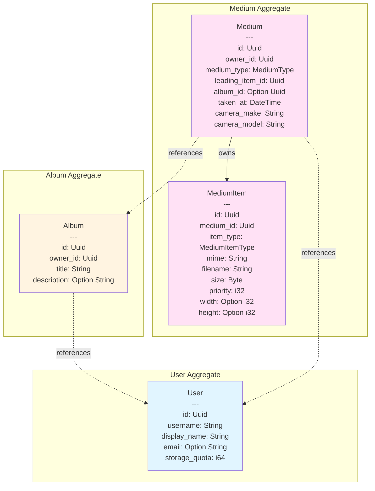
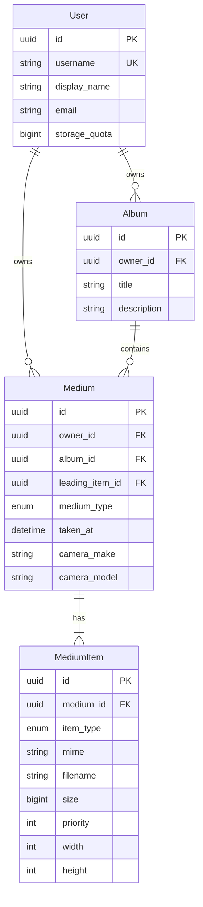
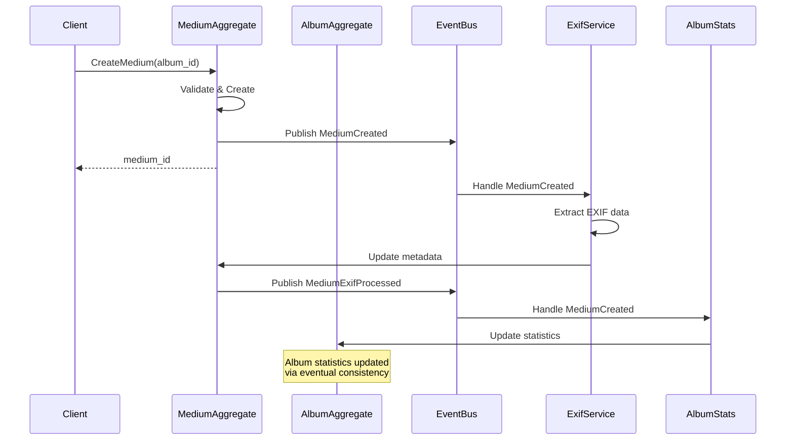

# Aggregate Boundaries and Relationships

This document provides a visual overview of the domain aggregates, their boundaries, and how they interact.

## Aggregate Overview



## Consistency Boundaries

### Strong Consistency (within aggregate)
Each box represents a **consistency boundary** - a transaction boundary within which all invariants must be maintained.

1. **User Aggregate**: Single entity, all changes atomic
2. **Album Aggregate**: Single entity, all changes atomic
3. **Medium Aggregate**: Medium + MediumItems, changes atomic within aggregate

### Eventual Consistency (cross-aggregate)
Dotted lines (-.->)represent **eventual consistency** - relationships that don't require immediate transactional consistency.

## Relationship Details



## Domain Events Flow



## Aggregate Interaction Rules

### 1. User → Medium
**Relationship**: One-to-Many
**Managed by**: Medium
**Consistency**: Foreign key (strong), but business logic is one-way
**Example**: Medium stores `owner_id`, but User doesn't track its media

### 2. User → Album
**Relationship**: One-to-Many
**Managed by**: Album
**Consistency**: Foreign key (strong), but business logic is one-way
**Example**: Album stores `owner_id`, but User doesn't track its albums

### 3. Album → Medium
**Relationship**: One-to-Many
**Managed by**: Medium
**Consistency**: Eventual (via domain events)
**Example**: Medium stores `album_id` and publishes events when it changes. Album queries media but doesn't directly manage the collection.

### 4. Medium → MediumItem
**Relationship**: One-to-Many (Composition)
**Managed by**: Medium (same aggregate)
**Consistency**: Strong (transactional)
**Example**: MediumItems are created/deleted as part of Medium operations. A Medium must always have at least one item.

## Cross-Aggregate Operations

### Adding Medium to Album
```
1. Client → CreateMedium(album_id: Some(uuid))
2. Medium aggregate validates album exists (query only)
3. Medium aggregate creates medium with album_id
4. Medium aggregate publishes MediumCreated event
5. Event handler updates album statistics (eventual)
```

### Changing Medium's Album
```
1. Client → UpdateMedium(album_id: new_album_id)
2. Medium aggregate stores old_album_id
3. Medium aggregate updates album_id
4. Medium aggregate publishes MediumAlbumChanged event
5. Event handlers update both old and new album statistics (eventual)
```

### Deleting Album
```
1. Client → DeleteAlbum(album_id)
2. Album aggregate checks if album is empty (query)
3. If not empty, what should happen?
   Option A: Reject deletion
   Option B: Set album_id = NULL on all media (requires Medium update)
   Option C: Cascade delete all media (requires Medium deletion)

Current implementation: Up to business rules (likely Option A or B)
```

## Transaction Boundaries

### Single Aggregate Operations (ACID)
These operations happen within a single transaction:
- Create/Update/Delete User
- Create/Update/Delete Album
- Create/Update/Delete Medium
- Add MediumItem to Medium

### Cross-Aggregate Operations (Eventually Consistent)
These operations span multiple aggregates and use events:
- Update album statistics when media added/removed
- Calculate user storage quota from all media
- Notify when user approaches quota limit

## Key Design Principles

1. **Aggregates are consistency boundaries**: Only operations within an aggregate are atomic
2. **Reference by ID, not by object**: Cross-aggregate relationships use UUIDs
3. **Use domain events for coordination**: Don't synchronously call other aggregates
4. **One aggregate per transaction**: Never modify multiple aggregates in one transaction
5. **Query flexibility**: Aggregates can query (read) other aggregates, but can't modify them
6. **Enforce invariants only within aggregate**: Don't try to enforce cross-aggregate invariants transactionally

## Example: Why Album Statistics are Eventually Consistent

**Problem**: Album needs to show `number_of_items`, `minimum_date`, `maximum_date`

**Naive approach (violates DDD)**:
```rust
// DON'T DO THIS
impl Album {
    fn add_medium(&mut self, medium: &Medium) {
        self.media.push(medium.id);
        self.number_of_items += 1;
        // This violates aggregate boundaries!
    }
}
```

**DDD approach (eventual consistency)**:
```rust
// Medium aggregate
impl Medium {
    fn set_album(&mut self, album_id: Option<Uuid>) {
        let old_album = self.album_id;
        self.album_id = album_id;
        self.publish(MediumAlbumChanged {
            medium_id: self.id,
            old_album_id: old,
            new_album_id: album_id
        });
    }
}

// Event handler (infrastructure)
async fn handle_medium_album_changed(event: MediumAlbumChanged) {
    // Update album statistics via query, not via aggregate modification
    album_repository.recalculate_stats(event.new_album_id).await;
    if let Some(old) = event.old_album_id {
        album_repository.recalculate_stats(old).await;
    }
}
```

This approach maintains aggregate boundaries while providing accurate statistics through eventual consistency.