# Photonic System Architecture

This document describes the system architecture of Photonic, including high-level diagrams, component structures, and data flows.

## Table of Contents

- [Architecture Overview](#architecture-overview)
- [Clean Hexagonal Architecture](#clean-hexagonal-architecture)
- [System Context Diagram (C4)](#system-context-diagram-c4)
- [Container Diagram (C4)](#container-diagram-c4)
- [Component Diagrams](#component-diagrams)
- [Processing Pipeline](#processing-pipeline)
- [Storage Architecture](#storage-architecture)
- [Database Schema](#database-schema)
- [State Machines](#state-machines)
- [Deployment Architecture](#deployment-architecture)

---

## Architecture Overview

Photonic follows **Clean Hexagonal Architecture** (Ports and Adapters) with clear separation of concerns across four main layers.

### Architecture Principles

1. **Dependency Inversion** - Dependencies point inward, outer layers depend on inner layers
2. **Independence of Frameworks** - Domain logic independent of Axum, SQLx, etc.
3. **Testability** - Business logic testable without infrastructure
4. **Independence of UI** - Can swap API with GraphQL, gRPC, CLI
5. **Independence of Database** - Can swap PostgreSQL with other databases
6. **Independence of External Services** - External services abstracted behind ports

### The Hexagon

```
                    ┌─────────────────────┐
                    │                     │
              ┌────►│   HTTP Handlers     │────┐
              │     │   (Driving Adapter) │    │
              │     └─────────────────────┘    │
              │                                 │
    ┌─────────┴──────────┐         ┌───────────▼────────┐
    │                    │         │                    │
    │  Application Layer │◄───────►│   Domain Layer     │
    │    (Use Cases)     │         │  (Business Logic)  │
    │                    │         │                    │
    └─────────┬──────────┘         └───────────▲────────┘
              │                                 │
              │     ┌─────────────────────┐    │
              └────►│  Repository Impls   │────┘
                    │  (Driven Adapter)   │
                    └─────────────────────┘
```

---

## Clean Hexagonal Architecture

### Layer Structure

```
┌─────────────────────────────────────────────────────────┐
│                   API Layer (Outermost)                 │
│  ┌────────────┐  ┌──────────┐  ┌──────────────┐       │
│  │  HTTP      │  │   gRPC   │  │     CLI      │       │
│  │  Handlers  │  │  (Future)│  │   (Future)   │       │
│  └──────┬─────┘  └─────┬────┘  └──────┬───────┘       │
└─────────┼──────────────┼───────────────┼───────────────┘
          │              │               │
┌─────────▼──────────────▼───────────────▼───────────────┐
│             Application Layer (Use Cases)               │
│  ┌──────────────┐              ┌──────────────┐       │
│  │   Commands   │              │   Queries    │       │
│  │              │              │              │       │
│  │ - CreateMed  │              │ - GetMedium  │       │
│  │ - DeleteMed  │              │ - ListMedia  │       │
│  │ - AddTags    │              │ - SearchMed  │       │
│  └──────┬───────┘              └──────┬───────┘       │
│         │                             │               │
│  ┌──────▼─────────────────────────────▼───────┐       │
│  │        Event Listeners (Async)             │       │
│  │  - ExifExtractor                           │       │
│  │  - FileM over                              │       │
│  │  - VariantGenerators                       │       │
│  └────────────────────────────────────────────┘       │
└─────────┼──────────────────────────────────────────────┘
          │
┌─────────▼──────────────────────────────────────────────┐
│              Domain Layer (Pure Business Logic)         │
│  ┌─────────────┐  ┌──────────────┐  ┌──────────────┐ │
│  │   User      │  │   Medium     │  │    Album     │ │
│  │  Domain     │  │   Domain     │  │   Domain     │ │
│  │             │  │              │  │              │ │
│  │ - Entity    │  │ - Entity     │  │ - Entity     │ │
│  │ - ValueObjs │  │ - ValueObjs  │  │ - ValueObjs  │ │
│  │ - Events    │  │ - Events     │  │ - Events     │ │
│  │ - Services  │  │ - Services   │  │ - Services   │ │
│  │ - Ports     │  │ - Ports      │  │ - Ports      │ │
│  └─────────────┘  └──────────────┘  └──────────────┘ │
└─────────┼──────────────────────────────────────────────┘
          │
┌─────────▼──────────────────────────────────────────────┐
│          Infrastructure Layer (Technical Details)       │
│  ┌───────────────────────────────────────────────┐    │
│  │              Event Bus (In-Memory)            │    │
│  │         (NATS, Kafka in future)               │    │
│  └────────┬──────────────────────┬─────────────┘     │
│           │                      │                    │
│  ┌────────▼──────────┐  ┌────────▼────────────┐      │
│  │   Repositories    │  │    File Storage     │      │
│  │  - PostgreSQL     │  │  - Filesystem       │      │
│  │    Adapters       │  │  - S3 (Future)      │      │
│  └────────┬──────────┘  └────────┬────────────┘      │
│           │                      │                    │
│  ┌────────▼──────────────────────▼────────────┐      │
│  │           External Services                │      │
│  │  - exiftool (Metadata Extraction)          │      │
│  │  - ML/AI Services (Future)                 │      │
│  └────────────────────────────────────────────┘      │
└─────────────────────────────────────────────────────────┘
```

### Dependencies Flow

```
API Layer
    ↓ depends on
Application Layer
    ↓ depends on
Domain Layer (depends on nothing)
    ↑ implemented by
Infrastructure Layer
```

**Key Rules:**
- Domain layer has ZERO dependencies
- Infrastructure implements domain ports (interfaces)
- Application orchestrates domain entities
- API translates HTTP to application commands

---

## System Context Diagram (C4)

### Level 1: System Context

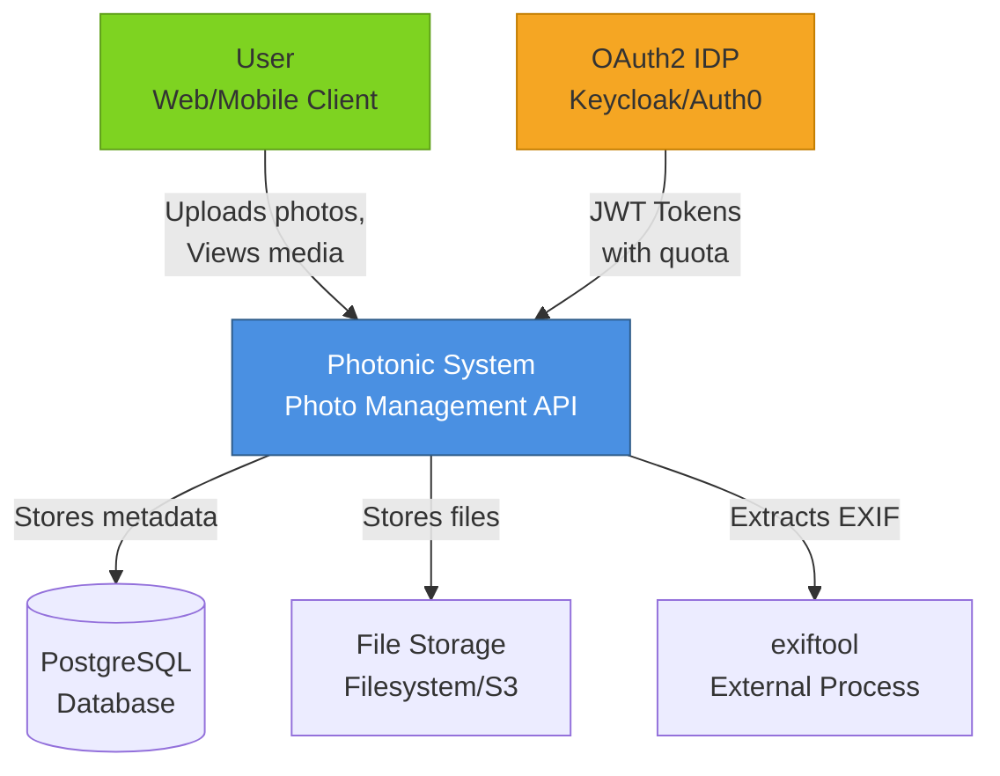

**External Systems:**
- **Users** - Web/mobile apps (future) consuming REST API
- **OAuth2 IDP** - Provides authentication and quota information
- **PostgreSQL** - Stores all structured data
- **File Storage** - Stores actual media files
- **exiftool** - External process for metadata extraction

---

## Container Diagram (C4)

### Level 2: Containers

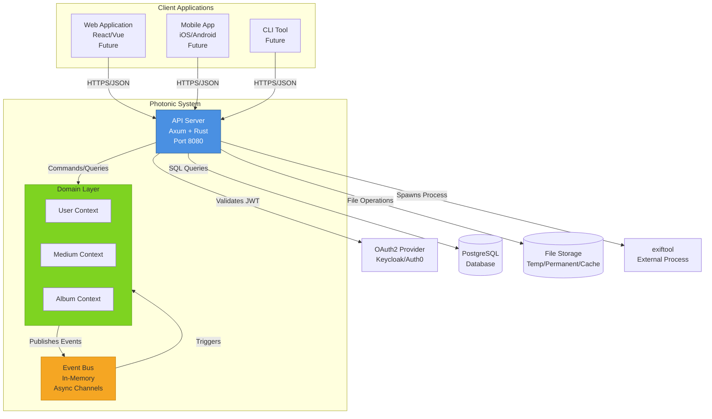

**Containers:**
- **API Server** - Axum-based REST API (current)
- **Event Bus** - In-memory event distribution (current)
- **Domain Layer** - Pure business logic
- **PostgreSQL** - Relational database
- **File Storage** - Tiered file storage system
- **exiftool** - EXIF metadata extractor

---

## Component Diagrams

### API Layer Components

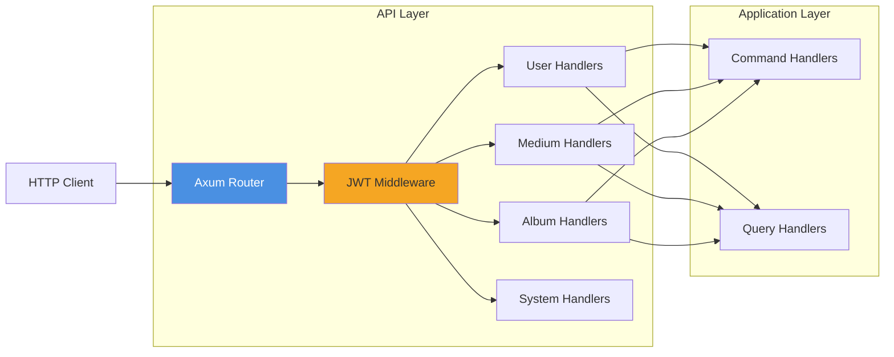

**Components:**
- **Router** - Route matching and dispatching
- **Middleware** - JWT validation, logging, tracing
- **Handlers** - HTTP request/response translation
- **Commands/Queries** - CQRS pattern implementation

### Application Layer Components

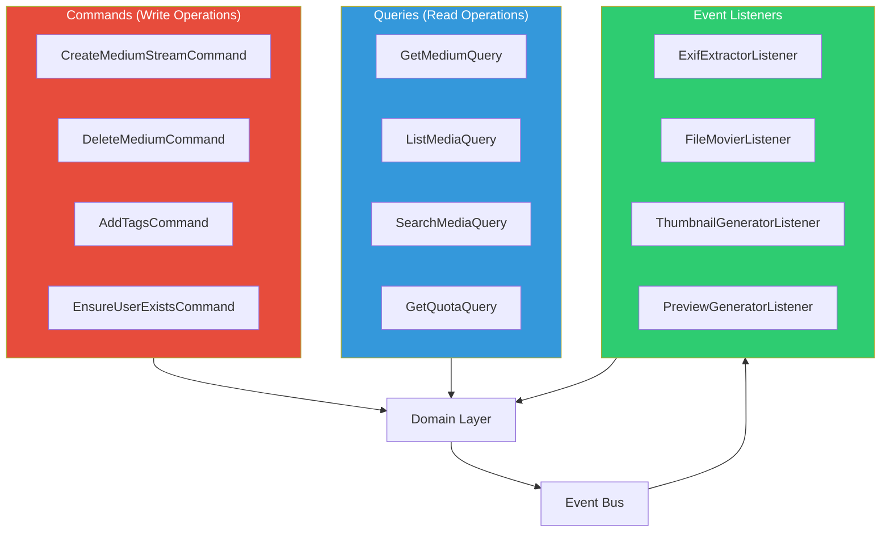

---

## Processing Pipeline

### Upload and Processing Flow

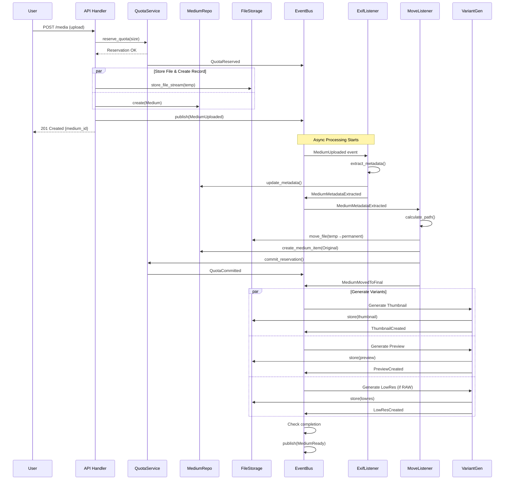

### State Transitions

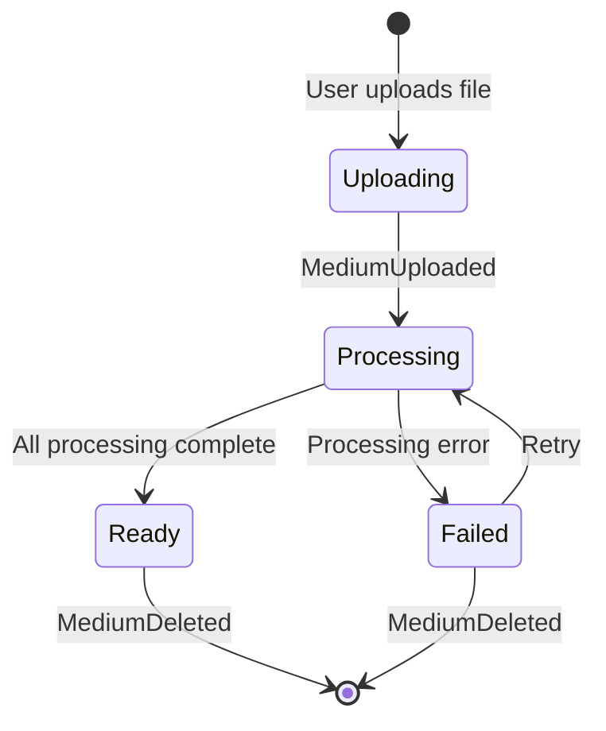

---

## Storage Architecture

### Storage Tier Hierarchy

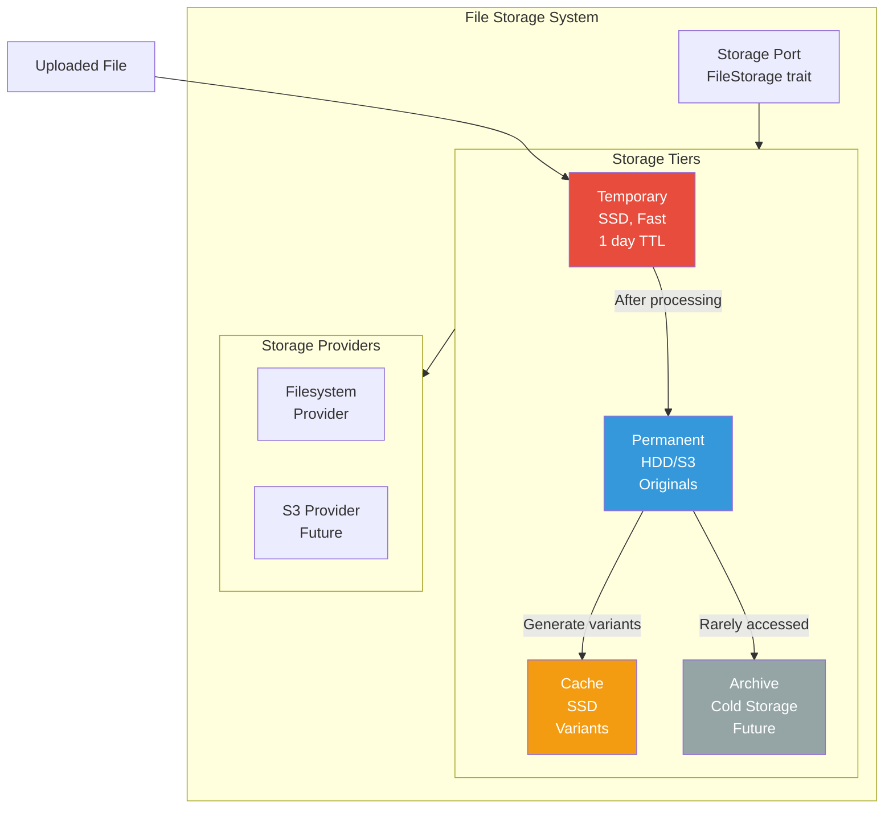

### Directory Structure

```
/storage/
├── temporary/              # Fast storage (SSD)
│   ├── {uuid}.jpg          # Uploaded files
│   ├── {uuid}.cr2
│   └── {uuid}.mp4
│
├── permanent/              # Main storage (HDD/S3)
│   ├── 2024/
│   │   ├── 12/
│   │   │   ├── Canon/
│   │   │   │   ├── IMG_1234.jpg
│   │   │   │   ├── IMG_1235.cr2
│   │   │   │   └── IMG_1236.jpg
│   │   │   ├── Sony/
│   │   │   │   └── DSC_0001.arw
│   │   │   └── Unknown/
│   │   │       └── photo.jpg
│   │   ├── 11/
│   │   └── 10/
│   └── 2023/
│       └── ...
│
└── cache/                  # Generated variants (SSD)
    ├── {medium_id}_thumb.jpg
    ├── {medium_id}_preview.jpg
    ├── {medium_id}_lowres.jpg
    └── ...
```

**Path Pattern Examples:**
```
Pattern: {year}/{month}/{camera_make}/{filename}
Result:  2024/12/Canon/IMG_1234.jpg

Pattern: {user_id}/{year}/{camera_model}/{filename}
Result:  550e8400-e29b-41d4-a716-446655440000/2024/EOS_R5/IMG_1234.jpg
```

---

## Database Schema

### Entity Relationship Diagram

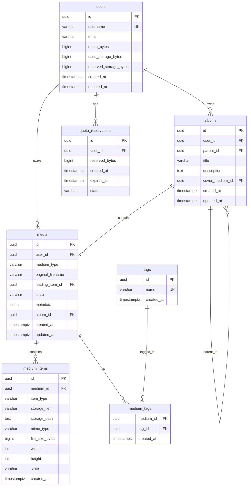

### Key Tables

**users**
- Stores user accounts from OAuth IDP
- Tracks quota allocation and usage
- Indexed on: id, username

**media**
- Aggregate root for medium
- Stores metadata as JSONB for flexibility
- Indexed on: id, user_id, state, created_at, (metadata->>'taken_at')

**medium_items**
- Child entity within Medium aggregate
- Stores all variants (original, thumbnail, preview, etc.)
- Cascade deletes with parent medium
- Indexed on: id, medium_id, item_type, state

**tags**
- Normalized tag names
- Many-to-many with media via medium_tags

**quota_reservations**
- Temporary quota holds during upload
- Cleaned up by background job
- Indexed on: user_id, status, expires_at

---

## State Machines

### Medium State Machine

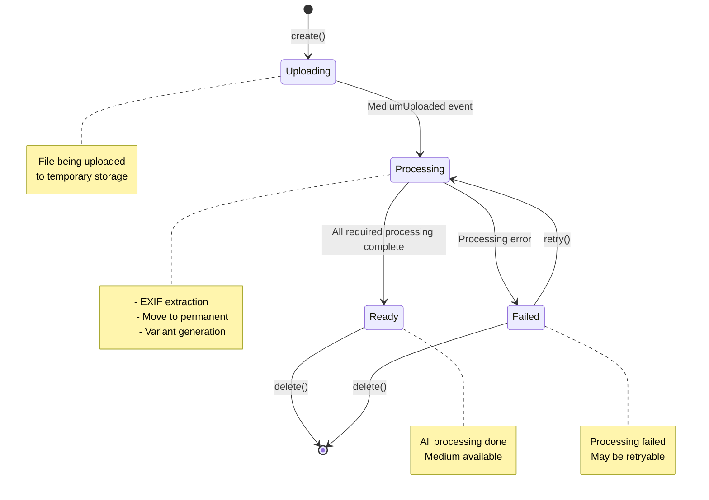

**Valid State Transitions:**
- `null → Uploading` (create)
- `Uploading → Processing` (upload complete)
- `Processing → Ready` (processing complete)
- `Processing → Failed` (error)
- `Failed → Processing` (retry)
- `Ready → [deleted]` (delete)
- `Failed → [deleted]` (delete)

### MediumItem State Machine

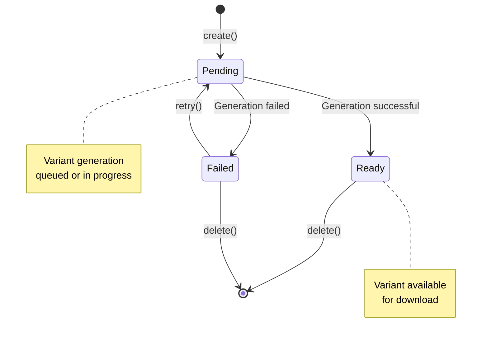

---

## Deployment Architecture

### Single Server Deployment (Current)

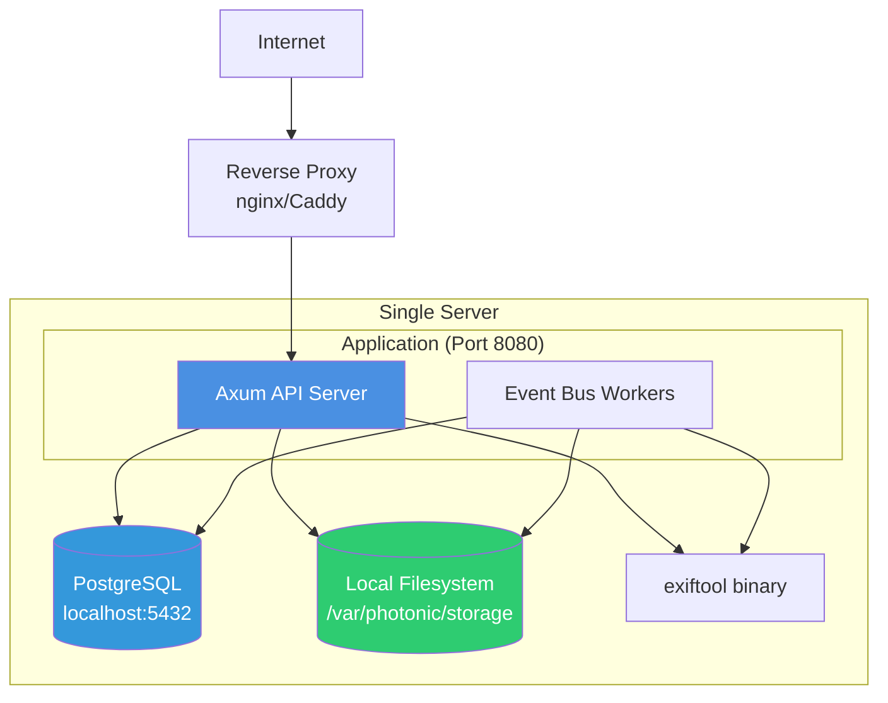

**Components:**
- **Reverse Proxy** - SSL termination, load balancing
- **API Server** - Axum application
- **PostgreSQL** - Local database
- **Filesystem** - Local storage tiers
- **exiftool** - System binary

### Scalable Deployment (Future)

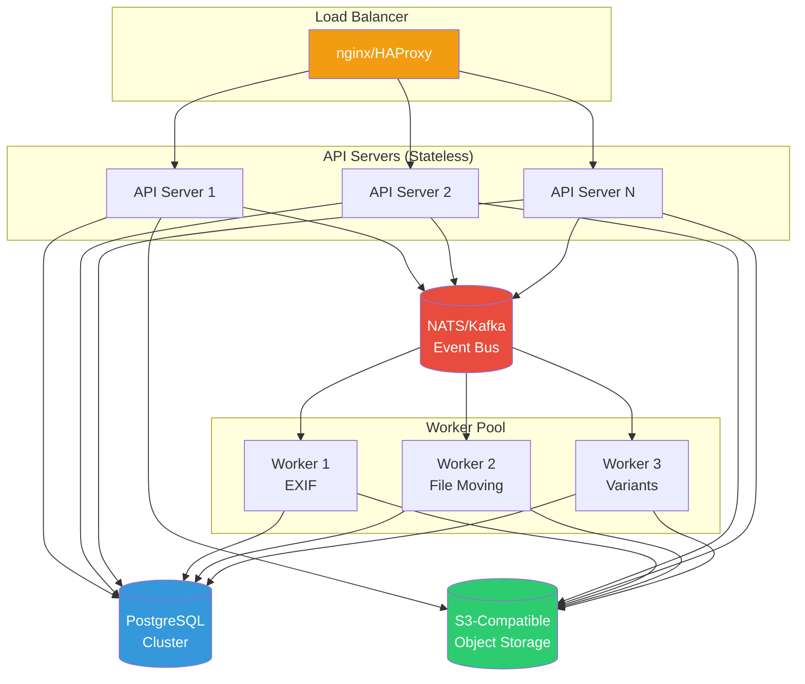

**Scaling Strategy:**
- **API Servers** - Horizontal scaling, stateless
- **Workers** - Scale based on queue depth
- **Database** - Primary-replica, read replicas
- **Storage** - S3-compatible object storage
- **Event Bus** - NATS or Kafka for distributed events

---

## Technology Stack

### Current Stack

**Backend:**
- Language: Rust (stable)
- Web Framework: Axum
- Database: PostgreSQL + SQLx
- Event Bus: In-memory (async channels)
- Authentication: JWT (jwt-authorizer)
- Tracing: OpenTelemetry + OTLP
- File Storage: Filesystem

**External:**
- EXIF: exiftool
- OAuth2: Any OIDC provider (Keycloak, Auth0, etc.)

### Future Enhancements

**Backend:**
- Event Bus: NATS or Kafka
- Storage: S3-compatible object storage
- Image Processing: libvips for better performance
- ML/AI: TensorFlow Serving or custom model server
- Cache: Redis for API caching
- Search: Elasticsearch or Meilisearch for full-text

**Frontend:**
- Web App: React or Vue.js
- Mobile: React Native or Flutter

---

## Monitoring and Observability

### Metrics to Track

```
Application Metrics:
- Request rate (req/sec)
- Response times (p50, p95, p99)
- Error rates (4xx, 5xx)
- Upload throughput (MB/sec)
- Processing pipeline latency

Business Metrics:
- Active users
- Total media count
- Storage usage by tier
- Quota utilization
- Processing success rate

Infrastructure Metrics:
- CPU usage
- Memory usage
- Disk I/O
- Database connections
- Event bus queue depth
```

### Logging Strategy

```
Structured logging with:
- Request ID (correlation)
- User ID
- Medium ID
- Timestamp
- Log level (ERROR, WARN, INFO, DEBUG)
- Component (domain, application, infrastructure)
- Message
- Context (additional fields)
```

### Tracing

```
OpenTelemetry distributed tracing:
- Trace upload request through entire pipeline
- Track processing steps (EXIF, move, variants)
- Identify bottlenecks
- Debug failures
```

---

## Summary

This architecture provides:

✅ **Clean Architecture** - Clear separation of concerns

✅ **Hexagonal Architecture** - Ports and adapters pattern

✅ **Event-Driven** - Async processing via domain events

✅ **Scalable** - Can scale horizontally

✅ **Testable** - Pure domain logic, mockable infrastructure

✅ **Flexible** - Easy to swap databases, storage, event bus

✅ **Observable** - Comprehensive logging, metrics, tracing

✅ **Resilient** - Error handling, retries, saga patterns

The architecture is designed to start simple (single server) and scale to distributed systems as needed, without major refactoring due to the clean separation of concerns.