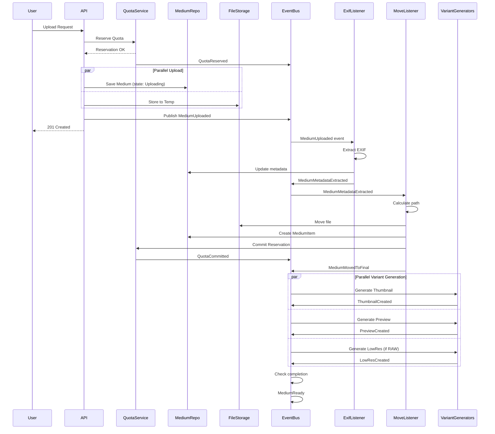

# Photonic Domain Events

This document describes the event-driven architecture of Photonic, including all domain events, event flows, saga patterns, and event handling.

## Table of Contents

- [Overview](#overview)
- [Event Architecture](#event-architecture)
- [User Context Events](#user-context-events)
- [Medium Context Events](#medium-context-events)
- [Album Context Events](#album-context-events-future)
- [Event Flows and Sagas](#event-flows-and-sagas)
- [Event Handling Patterns](#event-handling-patterns)
- [Event Store](#event-store-optional)

---

## Overview

### Event-Driven Architecture

Photonic uses domain events for:
- **Async Processing**: Upload processing pipeline runs asynchronously
- **Loose Coupling**: Bounded contexts communicate via events
- **Audit Trail**: All significant actions recorded as events
- **Eventual Consistency**: Accept temporary inconsistency for better performance
- **Scalability**: Event handlers can scale independently

### Event Characteristics

All domain events in Photonic are:
- **Immutable**: Once published, cannot be changed
- **Past Tense**: Named for what happened ("MediumUploaded", not "UploadMedium")
- **Self-Contained**: Include all necessary data for handlers
- **Idempotent Handlers**: Can process same event multiple times safely

---

## Event Architecture

### Event Bus

```
┌─────────────┐       ┌─────────────┐       ┌─────────────┐
│  Publisher  │──────►│  Event Bus  │──────►│ Subscriber  │
│  (Command)  │       │ (In-Memory) │       │ (Listener)  │
└─────────────┘       └─────────────┘       └─────────────┘
                             │
                             ├──────────────►│ Subscriber  │
                             │               │ (Listener)  │
                             │               └─────────────┘
                             │
                             └──────────────►│ Subscriber  │
                                             │ (Listener)  │
                                             └─────────────┘
```

**Current Implementation:** In-memory event bus (async channels)

**Future Implementations:**
- NATS for distributed processing
- Kafka for high-throughput scenarios
- RabbitMQ for complex routing

### Event Base Structure

All events share this base structure:

```rust
pub trait DomainEvent: Send + Sync + Clone {
    fn event_id(&self) -> Uuid;
    fn aggregate_id(&self) -> Uuid;
    fn aggregate_type(&self) -> &str; // "User", "Medium", "Album"
    fn event_type(&self) -> &str;     // "MediumUploaded", etc.
    fn occurred_at(&self) -> DateTime<Utc>;
    fn user_id(&self) -> Option<Uuid>; // Who triggered the event
}
```

**JSON Representation:**
```json
{
  "event_id": "uuid",
  "aggregate_id": "uuid",
  "aggregate_type": "Medium",
  "event_type": "MediumUploaded",
  "occurred_at": "2024-12-16T10:35:00Z",
  "user_id": "uuid",
  "payload": {
    // Event-specific data
  }
}
```

---

## User Context Events

### UserCreated

**Published When:** First-time user logs in via OAuth

**Rust Definition:**
```rust
pub struct UserCreated {
    pub event_id: Uuid,
    pub user_id: UserId,
    pub username: Username,
    pub email: Option<Email>,
    pub quota_bytes: u64,
    pub occurred_at: DateTime<Utc>,
}
```

**JSON Schema:**
```json
{
  "event_id": "550e8400-e29b-41d4-a716-446655440000",
  "aggregate_id": "user-uuid",
  "aggregate_type": "User",
  "event_type": "UserCreated",
  "occurred_at": "2024-12-16T09:00:00Z",
  "user_id": "user-uuid",
  "payload": {
    "user_id": "user-uuid",
    "username": "john_doe",
    "email": "john@example.com",
    "quota_bytes": 10737418240
  }
}
```

**Subscribers:**
- Analytics service (track new users)
- Notification service (send welcome email)
- Audit log service

---

### UserQuotaUpdated

**Published When:** IDP changes user's quota

**Rust Definition:**
```rust
pub struct UserQuotaUpdated {
    pub event_id: Uuid,
    pub user_id: UserId,
    pub old_quota_bytes: u64,
    pub new_quota_bytes: u64,
    pub occurred_at: DateTime<Utc>,
}
```

**JSON Schema:**
```json
{
  "event_id": "uuid",
  "aggregate_id": "user-uuid",
  "aggregate_type": "User",
  "event_type": "UserQuotaUpdated",
  "occurred_at": "2024-12-16T14:30:00Z",
  "user_id": "user-uuid",
  "payload": {
    "user_id": "user-uuid",
    "old_quota_bytes": 10737418240,
    "new_quota_bytes": 21474836480
  }
}
```

**Subscribers:**
- Notification service (notify user of quota change)
- Analytics service

---

### QuotaReserved

**Published When:** Quota reserved for upcoming upload

**Rust Definition:**
```rust
pub struct QuotaReserved {
    pub event_id: Uuid,
    pub user_id: UserId,
    pub reservation_id: ReservationId,
    pub reserved_bytes: u64,
    pub available_after_reservation: u64,
    pub occurred_at: DateTime<Utc>,
}
```

**JSON Schema:**
```json
{
  "event_id": "uuid",
  "aggregate_id": "user-uuid",
  "aggregate_type": "User",
  "event_type": "QuotaReserved",
  "occurred_at": "2024-12-16T10:35:00Z",
  "user_id": "user-uuid",
  "payload": {
    "user_id": "user-uuid",
    "reservation_id": "reservation-uuid",
    "reserved_bytes": 8388608,
    "available_after_reservation": 2348810240
  }
}
```

**Subscribers:**
- Monitoring service (track quota usage patterns)
- Cleanup job (schedule expiration check)

---

### QuotaCommitted

**Published When:** Reservation converted to permanent usage

**Rust Definition:**
```rust
pub struct QuotaCommitted {
    pub event_id: Uuid,
    pub user_id: UserId,
    pub reservation_id: ReservationId,
    pub committed_bytes: u64,
    pub total_used_bytes: u64,
    pub occurred_at: DateTime<Utc>,
}
```

**JSON Schema:**
```json
{
  "event_id": "uuid",
  "aggregate_id": "user-uuid",
  "aggregate_type": "User",
  "event_type": "QuotaCommitted",
  "occurred_at": "2024-12-16T10:36:00Z",
  "user_id": "user-uuid",
  "payload": {
    "user_id": "user-uuid",
    "reservation_id": "reservation-uuid",
    "committed_bytes": 8388608,
    "total_used_bytes": 8388608
  }
}
```

**Subscribers:**
- Analytics service (track storage growth)
- Monitoring service

---

### QuotaReleased

**Published When:** Reservation cancelled/failed

**Rust Definition:**
```rust
pub struct QuotaReleased {
    pub event_id: Uuid,
    pub user_id: UserId,
    pub reservation_id: ReservationId,
    pub released_bytes: u64,
    pub reason: String,
    pub occurred_at: DateTime<Utc>,
}
```

**JSON Schema:**
```json
{
  "event_id": "uuid",
  "aggregate_id": "user-uuid",
  "aggregate_type": "User",
  "event_type": "QuotaReleased",
  "occurred_at": "2024-12-16T10:35:25Z",
  "user_id": "user-uuid",
  "payload": {
    "user_id": "user-uuid",
    "reservation_id": "reservation-uuid",
    "released_bytes": 8388608,
    "reason": "UploadFailed"
  }
}
```

**Release Reasons:**
- `UploadFailed`
- `ProcessingFailed`
- `Timeout`
- `UserCancelled`

**Subscribers:**
- Monitoring service (track failure rates)
- Analytics service

---

### UserQuotaExceeded

**Published When:** Upload rejected due to insufficient quota

**Rust Definition:**
```rust
pub struct UserQuotaExceeded {
    pub event_id: Uuid,
    pub user_id: UserId,
    pub requested_bytes: u64,
    pub available_bytes: u64,
    pub occurred_at: DateTime<Utc>,
}
```

**JSON Schema:**
```json
{
  "event_id": "uuid",
  "aggregate_id": "user-uuid",
  "aggregate_type": "User",
  "event_type": "UserQuotaExceeded",
  "occurred_at": "2024-12-16T10:35:00Z",
  "user_id": "user-uuid",
  "payload": {
    "user_id": "user-uuid",
    "requested_bytes": 52428800,
    "available_bytes": 1048576
  }
}
```

**Subscribers:**
- Notification service (notify user to upgrade)
- Analytics service (track quota pressure)
- Monitoring service (alert on frequent occurrences)

---

## Medium Context Events

### MediumUploaded

**Published When:** File successfully uploaded to temporary storage

**Rust Definition:**
```rust
pub struct MediumUploaded {
    pub event_id: Uuid,
    pub medium_id: MediumId,
    pub user_id: UserId,
    pub file_location: StorageLocation,
    pub mime_type: MimeType,
    pub file_size: u64,
    pub original_filename: FileName,
    pub occurred_at: DateTime<Utc>,
}
```

**JSON Schema:**
```json
{
  "event_id": "uuid",
  "aggregate_id": "medium-uuid",
  "aggregate_type": "Medium",
  "event_type": "MediumUploaded",
  "occurred_at": "2024-12-16T10:35:00Z",
  "user_id": "user-uuid",
  "payload": {
    "medium_id": "medium-uuid",
    "user_id": "user-uuid",
    "file_location": {
      "tier": "Temporary",
      "path": "medium-uuid.jpg"
    },
    "mime_type": "image/jpeg",
    "file_size": 8388608,
    "original_filename": "IMG_1234.jpg"
  }
}
```

**Subscribers:**
- **EXIF Extractor** (triggers metadata extraction)
- Analytics service (track uploads)
- Monitoring service (track upload performance)

---

### MediumMetadataExtracted

**Published When:** EXIF metadata successfully extracted

**Rust Definition:**
```rust
pub struct MediumMetadataExtracted {
    pub event_id: Uuid,
    pub medium_id: MediumId,
    pub user_id: UserId,
    pub metadata: MediumMetadata,
    pub occurred_at: DateTime<Utc>,
}
```

**JSON Schema:**
```json
{
  "event_id": "uuid",
  "aggregate_id": "medium-uuid",
  "aggregate_type": "Medium",
  "event_type": "MediumMetadataExtracted",
  "occurred_at": "2024-12-16T10:35:15Z",
  "user_id": "user-uuid",
  "payload": {
    "medium_id": "medium-uuid",
    "metadata": {
      "taken_at": "2024-12-15T14:22:00Z",
      "camera_make": "Canon",
      "camera_model": "EOS R5",
      "lens_model": "RF 24-70mm F2.8 L IS USM",
      "iso": 400,
      "aperture": 2.8,
      "shutter_speed": "1/250",
      "focal_length": 50.0,
      "gps_coordinates": {
        "latitude": 52.520008,
        "longitude": 13.404954
      }
    }
  }
}
```

**Subscribers:**
- **Path Calculator & File Mover** (triggers move to final location)
- Search indexer (index metadata for search)
- Analytics service (track camera usage patterns)

---

### MediumMovedToFinal

**Published When:** File moved from temporary to permanent storage

**Rust Definition:**
```rust
pub struct MediumMovedToFinal {
    pub event_id: Uuid,
    pub medium_id: MediumId,
    pub user_id: UserId,
    pub item_id: MediumItemId,
    pub from_location: StorageLocation,
    pub to_location: StorageLocation,
    pub occurred_at: DateTime<Utc>,
}
```

**JSON Schema:**
```json
{
  "event_id": "uuid",
  "aggregate_id": "medium-uuid",
  "aggregate_type": "Medium",
  "event_type": "MediumMovedToFinal",
  "occurred_at": "2024-12-16T10:35:30Z",
  "user_id": "user-uuid",
  "payload": {
    "medium_id": "medium-uuid",
    "item_id": "item-uuid",
    "from_location": {
      "tier": "Temporary",
      "path": "medium-uuid.jpg"
    },
    "to_location": {
      "tier": "Permanent",
      "path": "2024/12/Canon/IMG_1234.jpg"
    }
  }
}
```

**Subscribers:**
- **Thumbnail Generator** (parallel)
- **Preview Generator** (parallel)
- **Low-Res Generator** (parallel, if RAW)
- Quota committer (commits reservation)
- Monitoring service

---

### ThumbnailCreated

**Published When:** Thumbnail variant generated

**Rust Definition:**
```rust
pub struct ThumbnailCreated {
    pub event_id: Uuid,
    pub medium_id: MediumId,
    pub user_id: UserId,
    pub item_id: MediumItemId,
    pub storage_location: StorageLocation,
    pub mime_type: MimeType,
    pub file_size: u64,
    pub dimensions: Dimensions,
    pub occurred_at: DateTime<Utc>,
}
```

**JSON Schema:**
```json
{
  "event_id": "uuid",
  "aggregate_id": "medium-uuid",
  "aggregate_type": "Medium",
  "event_type": "ThumbnailCreated",
  "occurred_at": "2024-12-16T10:35:45Z",
  "user_id": "user-uuid",
  "payload": {
    "medium_id": "medium-uuid",
    "item_id": "item-uuid",
    "item_type": "Thumbnail",
    "storage_location": {
      "tier": "Cache",
      "path": "medium-uuid_thumb.jpg"
    },
    "mime_type": "image/jpeg",
    "file_size": 45000,
    "dimensions": {
      "width": 200,
      "height": 200
    }
  }
}
```

**Subscribers:**
- Completion checker (checks if all processing done)
- Monitoring service

---

### PreviewCreated

**Published When:** Preview variant generated

**Rust Definition:**
```rust
pub struct PreviewCreated {
    pub event_id: Uuid,
    pub medium_id: MediumId,
    pub user_id: UserId,
    pub item_id: MediumItemId,
    pub storage_location: StorageLocation,
    pub mime_type: MimeType,
    pub file_size: u64,
    pub dimensions: Dimensions,
    pub occurred_at: DateTime<Utc>,
}
```

**JSON Schema:**
```json
{
  "event_id": "uuid",
  "aggregate_id": "medium-uuid",
  "aggregate_type": "Medium",
  "event_type": "PreviewCreated",
  "occurred_at": "2024-12-16T10:35:50Z",
  "user_id": "user-uuid",
  "payload": {
    "medium_id": "medium-uuid",
    "item_id": "item-uuid",
    "item_type": "Preview",
    "storage_location": {
      "tier": "Cache",
      "path": "medium-uuid_preview.jpg"
    },
    "mime_type": "image/jpeg",
    "file_size": 524288,
    "dimensions": {
      "width": 1024,
      "height": 683
    }
  }
}
```

**Subscribers:**
- **Image Recognition** (uses preview for ML processing)
- Completion checker
- Monitoring service

---

### LowResCreated

**Published When:** Low-res JPEG generated from RAW

**Rust Definition:**
```rust
pub struct LowResCreated {
    pub event_id: Uuid,
    pub medium_id: MediumId,
    pub user_id: UserId,
    pub item_id: MediumItemId,
    pub storage_location: StorageLocation,
    pub mime_type: MimeType,
    pub file_size: u64,
    pub dimensions: Dimensions,
    pub occurred_at: DateTime<Utc>,
}
```

**JSON Schema:**
```json
{
  "event_id": "uuid",
  "aggregate_id": "medium-uuid",
  "aggregate_type": "Medium",
  "event_type": "LowResCreated",
  "occurred_at": "2024-12-16T10:35:55Z",
  "user_id": "user-uuid",
  "payload": {
    "medium_id": "medium-uuid",
    "item_id": "item-uuid",
    "item_type": "LowRes",
    "storage_location": {
      "tier": "Cache",
      "path": "medium-uuid_lowres.jpg"
    },
    "mime_type": "image/jpeg",
    "file_size": 2097152,
    "dimensions": {
      "width": 2048,
      "height": 1365
    }
  }
}
```

**Subscribers:**
- **Image Recognition** (prefers low-res for better quality)
- Completion checker
- Monitoring service

---

### ImageRecognitionCompleted (Future)

**Published When:** ML analysis completed

**Rust Definition:**
```rust
pub struct ImageRecognitionCompleted {
    pub event_id: Uuid,
    pub medium_id: MediumId,
    pub user_id: UserId,
    pub faces: Vec<FaceDetection>,
    pub objects: Vec<ObjectLabel>,
    pub scene: Option<SceneClassification>,
    pub occurred_at: DateTime<Utc>,
}
```

**JSON Schema:**
```json
{
  "event_id": "uuid",
  "aggregate_id": "medium-uuid",
  "aggregate_type": "Medium",
  "event_type": "ImageRecognitionCompleted",
  "occurred_at": "2024-12-16T10:36:10Z",
  "user_id": "user-uuid",
  "payload": {
    "medium_id": "medium-uuid",
    "faces": [
      {"x": 100, "y": 150, "width": 80, "height": 100, "confidence": 0.95}
    ],
    "objects": [
      {"label": "mountain", "confidence": 0.92},
      {"label": "sky", "confidence": 0.88}
    ],
    "scene": {
      "label": "landscape",
      "confidence": 0.89
    }
  }
}
```

**Subscribers:**
- Search indexer (index detected objects/scenes)
- Completion checker
- Analytics service

---

### MediumReady

**Published When:** All required processing complete

**Rust Definition:**
```rust
pub struct MediumReady {
    pub event_id: Uuid,
    pub medium_id: MediumId,
    pub user_id: UserId,
    pub total_processing_time_ms: u64,
    pub variants_created: Vec<MediumItemType>,
    pub occurred_at: DateTime<Utc>,
}
```

**JSON Schema:**
```json
{
  "event_id": "uuid",
  "aggregate_id": "medium-uuid",
  "aggregate_type": "Medium",
  "event_type": "MediumReady",
  "occurred_at": "2024-12-16T10:36:15Z",
  "user_id": "user-uuid",
  "payload": {
    "medium_id": "medium-uuid",
    "total_processing_time_ms": 25000,
    "variants_created": ["Original", "Thumbnail", "Preview", "LowRes"]
  }
}
```

**Subscribers:**
- Notification service (notify user if requested)
- Analytics service (track processing times)
- Monitoring service (track success rate)

---

### MediumProcessingFailed

**Published When:** Any processing step fails

**Rust Definition:**
```rust
pub struct MediumProcessingFailed {
    pub event_id: Uuid,
    pub medium_id: MediumId,
    pub user_id: UserId,
    pub step: ProcessingStep,
    pub error: String,
    pub is_retryable: bool,
    pub occurred_at: DateTime<Utc>,
}

pub enum ProcessingStep {
    Upload,
    ExifExtraction,
    PathCalculation,
    MovingToFinal,
    ThumbnailGeneration,
    PreviewGeneration,
    LowResGeneration,
    ImageRecognition,
}
```

**JSON Schema:**
```json
{
  "event_id": "uuid",
  "aggregate_id": "medium-uuid",
  "aggregate_type": "Medium",
  "event_type": "MediumProcessingFailed",
  "occurred_at": "2024-12-16T10:35:20Z",
  "user_id": "user-uuid",
  "payload": {
    "medium_id": "medium-uuid",
    "step": "ExifExtraction",
    "error": "Failed to parse EXIF data: corrupt header",
    "is_retryable": false
  }
}
```

**Subscribers:**
- Retry scheduler (if retryable)
- Notification service (notify user of failure)
- Monitoring service (alert on high failure rates)
- Quota service (release reservation)

---

### MediumDeleted

**Published When:** User deletes medium

**Rust Definition:**
```rust
pub struct MediumDeleted {
    pub event_id: Uuid,
    pub medium_id: MediumId,
    pub user_id: UserId,
    pub freed_storage_bytes: u64,
    pub occurred_at: DateTime<Utc>,
}
```

**JSON Schema:**
```json
{
  "event_id": "uuid",
  "aggregate_id": "medium-uuid",
  "aggregate_type": "Medium",
  "event_type": "MediumDeleted",
  "occurred_at": "2024-12-16T12:00:00Z",
  "user_id": "user-uuid",
  "payload": {
    "medium_id": "medium-uuid",
    "freed_storage_bytes": 8500000
  }
}
```

**Subscribers:**
- Search indexer (remove from index)
- Analytics service
- Monitoring service

---

### MediumTagged

**Published When:** Tags added or removed

**Rust Definition:**
```rust
pub struct MediumTagged {
    pub event_id: Uuid,
    pub medium_id: MediumId,
    pub user_id: UserId,
    pub added_tags: Vec<Tag>,
    pub removed_tags: Vec<Tag>,
    pub occurred_at: DateTime<Utc>,
}
```

**JSON Schema:**
```json
{
  "event_id": "uuid",
  "aggregate_id": "medium-uuid",
  "aggregate_type": "Medium",
  "event_type": "MediumTagged",
  "occurred_at": "2024-12-16T11:00:00Z",
  "user_id": "user-uuid",
  "payload": {
    "medium_id": "medium-uuid",
    "added_tags": ["vacation", "landscape"],
    "removed_tags": ["draft"]
  }
}
```

**Subscribers:**
- Search indexer (update tags in index)
- Analytics service

---

### MediumMovedToAlbum

**Published When:** Medium assigned to album

**Rust Definition:**
```rust
pub struct MediumMovedToAlbum {
    pub event_id: Uuid,
    pub medium_id: MediumId,
    pub user_id: UserId,
    pub album_id: AlbumId,
    pub occurred_at: DateTime<Utc>,
}
```

**JSON Schema:**
```json
{
  "event_id": "uuid",
  "aggregate_id": "medium-uuid",
  "aggregate_type": "Medium",
  "event_type": "MediumMovedToAlbum",
  "occurred_at": "2024-12-16T11:10:00Z",
  "user_id": "user-uuid",
  "payload": {
    "medium_id": "medium-uuid",
    "album_id": "album-uuid"
  }
}
```

**Subscribers:**
- Album service (update album cover if needed)
- Analytics service

---

## Album Context Events (Future)

### AlbumCreated

**Published When:** User creates new album

**JSON Schema:**
```json
{
  "event_id": "uuid",
  "aggregate_id": "album-uuid",
  "aggregate_type": "Album",
  "event_type": "AlbumCreated",
  "occurred_at": "2024-12-16T11:00:00Z",
  "user_id": "user-uuid",
  "payload": {
    "album_id": "album-uuid",
    "title": "Vacation 2024",
    "parent_id": null
  }
}
```

---

### AlbumUpdated

**Published When:** Album title/description/cover updated

---

### AlbumDeleted

**Published When:** User deletes album

---

## Event Flows and Sagas

### Upload and Processing Saga

This is the main saga for the entire upload-to-ready lifecycle.



### Event Dependencies

#### Sequential Dependencies (Must follow order)

```
MediumUploaded
    ↓
MediumMetadataExtracted (required if path needs metadata)
    ↓
MediumMovedToFinal
    ↓
[Parallel] ThumbnailCreated | PreviewCreated | LowResCreated
    ↓
MediumReady
    ↓
QuotaCommitted
```

#### Parallel Processing (No dependencies)

These events trigger independent handlers that can run simultaneously:

```
MediumMovedToFinal
    ├─→ ThumbnailCreated
    ├─→ PreviewCreated
    └─→ LowResCreated (if RAW)
          ↓
      ImageRecognitionCompleted (future)
```

### Failure Handling Saga

```
MediumProcessingFailed
    ↓
  [Check if retryable]
    ├─→ Yes → Schedule retry (exponential backoff)
    │         Max 3 retries
    │         ↓
    │       [Retry exhausted] → Permanently failed
    │                          → QuotaReleased
    │                          → Notify user
    └─→ No  → Permanently failed
              → QuotaReleased
              → Notify user
```

---

## Event Handling Patterns

### Idempotent Event Handlers

All event handlers must be idempotent (can process same event multiple times):

```rust
#[async_trait]
impl EventHandler<MediumUploaded> for ExifExtractor {
    async fn handle(&self, event: &MediumUploaded) -> Result<()> {
        // 1. Check if already processed
        let medium = self.repo.find_by_id(event.medium_id).await?;
        if medium.metadata.is_some() {
            // Already extracted, skip
            return Ok(());
        }

        // 2. Process event
        let metadata = self.extractor.extract(event.file_location).await?;

        // 3. Update and publish
        medium.update_metadata(metadata);
        self.repo.save(&medium).await?;
        self.bus.publish(MediumMetadataExtracted { ... }).await?;

        Ok(())
    }
}
```

**Idempotency Strategies:**
- Check current state before processing
- Use database constraints (unique indexes)
- Use `INSERT ... ON CONFLICT DO NOTHING`
- Store processed event IDs
- Use optimistic locking (version numbers)

---

### Error Handling

```rust
#[async_trait]
impl EventHandler<MediumUploaded> for ExifExtractor {
    async fn handle(&self, event: &MediumUploaded) -> Result<()> {
        match self.extract_metadata(event).await {
            Ok(metadata) => {
                // Success path
                self.publish_success(event, metadata).await?;
                Ok(())
            }
            Err(e) if e.is_retryable() => {
                // Transient error - will be retried
                error!("Transient error extracting EXIF: {}", e);
                Err(e)
            }
            Err(e) => {
                // Permanent error - publish failure event
                error!("Permanent error extracting EXIF: {}", e);
                self.publish_failure(event, e).await?;
                Ok(()) // Handler succeeded (failure was handled)
            }
        }
    }
}
```

**Error Types:**
- **Transient**: Network timeout, temporary service unavailable → Retry
- **Permanent**: Corrupted file, missing required data → Fail immediately
- **Unknown**: Treat as transient initially, become permanent after max retries

---

### Retry Strategy

```rust
pub struct RetryConfig {
    pub max_attempts: u32,        // e.g., 3
    pub initial_delay_ms: u64,    // e.g., 1000 (1 second)
    pub max_delay_ms: u64,        // e.g., 60000 (1 minute)
    pub multiplier: f64,          // e.g., 2.0 (exponential backoff)
}

impl RetryConfig {
    pub fn calculate_delay(&self, attempt: u32) -> Duration {
        let delay_ms = self.initial_delay_ms as f64
            * self.multiplier.powi(attempt as i32 - 1);
        let capped_ms = delay_ms.min(self.max_delay_ms as f64);
        Duration::from_millis(capped_ms as u64)
    }
}
```

**Example retry delays:**
- Attempt 1: 1 second
- Attempt 2: 2 seconds
- Attempt 3: 4 seconds
- Attempt 4: 8 seconds (max retries reached)

---

### Event Ordering Guarantees

**Within Single Aggregate:**
- Events for same aggregate ID are processed in order
- Use event sequence numbers

```rust
pub struct MediumEventEnvelope {
    pub event: MediumEvent,
    pub sequence: u64, // Monotonically increasing
}
```

**Across Aggregates:**
- No ordering guarantee
- Use correlation IDs to trace related events

```rust
pub struct EventMetadata {
    pub event_id: Uuid,
    pub correlation_id: Uuid, // Links related events
    pub causation_id: Uuid,   // What caused this event
}
```

---

## Event Store (Optional)

For full event sourcing, persist all events:

### Event Store Schema

```sql
CREATE TABLE domain_events (
    event_id UUID PRIMARY KEY,
    aggregate_id UUID NOT NULL,
    aggregate_type VARCHAR(50) NOT NULL,
    event_type VARCHAR(100) NOT NULL,
    event_data JSONB NOT NULL,
    occurred_at TIMESTAMPTZ NOT NULL,
    user_id UUID,
    sequence BIGSERIAL,

    -- Indexes
    INDEX idx_events_aggregate (aggregate_id, aggregate_type, sequence),
    INDEX idx_events_type (event_type),
    INDEX idx_events_occurred_at (occurred_at),
    INDEX idx_events_user (user_id)
);
```

### Event Store Operations

```rust
#[async_trait]
pub trait EventStore: Send + Sync {
    /// Append event to store
    async fn append(&self, event: &dyn DomainEvent) -> Result<()>;

    /// Get all events for aggregate
    async fn get_events(
        &self,
        aggregate_id: Uuid,
        aggregate_type: &str
    ) -> Result<Vec<Box<dyn DomainEvent>>>;

    /// Get events by type
    async fn get_by_type(
        &self,
        event_type: &str,
        from: DateTime<Utc>,
        to: DateTime<Utc>
    ) -> Result<Vec<Box<dyn DomainEvent>>>;

    /// Replay events (for rebuilding read models)
    async fn replay_all(&self) -> Result<Stream<Box<dyn DomainEvent>>>;
}
```

---

## Summary

### Event Catalog

**User Context (6 events):**
- UserCreated
- UserQuotaUpdated
- QuotaReserved
- QuotaCommitted
- QuotaReleased
- UserQuotaExceeded

**Medium Context (11 events):**
- MediumUploaded
- MediumMetadataExtracted
- MediumMovedToFinal
- ThumbnailCreated
- PreviewCreated
- LowResCreated
- ImageRecognitionCompleted (future)
- MediumReady
- MediumProcessingFailed
- MediumDeleted
- MediumTagged
- MediumMovedToAlbum

**Album Context (3 events - future):**
- AlbumCreated
- AlbumUpdated
- AlbumDeleted

**Total: 20 domain events**

### Key Patterns

✅ **Event-Driven Architecture** - Async processing via events

✅ **Saga Pattern** - Multi-step workflows coordinated by events

✅ **Idempotent Handlers** - Safe to process events multiple times

✅ **Error Handling** - Transient vs permanent errors, retry strategies

✅ **Event Store** - Optional persistence for event sourcing

✅ **Loose Coupling** - Contexts communicate only via events

This event-driven design enables:
- Scalable async processing
- Resilient failure handling
- Audit trail and debugging
- Eventual consistency
- Easy addition of new features (just add event handlers)