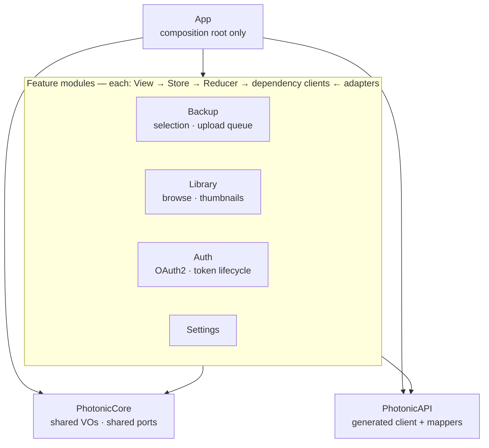

# iOS Architecture Rules & Enforcement Plan

Status: draft v3 — v2 introduced feature modules; **v3 supersedes the native-MVVM
call with TCA everywhere**, decided from project goals (full client, background
uploads, solo + learning goals), not from the prototype code
Scope: `apple/` (Photonic iOS/macOS client)
Supersedes: v1 (four-layer Domain/Application/Infrastructure/Interface taxonomy)

## Goal

Make the app's architecture a set of **machine-checked rules** instead of
conventions that only survive while someone remembers them. The app must scale
by being **modular along feature lines**, with framework quarantine enforced
both by tests (now) and by the compiler (modules).

### Why not the four-layer taxonomy

The server owns the domain: invariants like checksum dedup, album membership,
and event sourcing live in `server/` (`docs/aggregate-boundaries.md`). The
client is a projection plus device orchestration. Tactical DDD in the app
(aggregates, domain services, rich entities) builds ceremony around types like
`Album(id, name)` that have no invariant to protect — and the audit shows the
ceremony already failed once (`DiscoverServerUseCase` bypassed its own port
layer to reach the generated client).

What survives from DDD/hexagonal, and scales:

- **One bounded context** (Photo Backup Client) with language locked to
  `openapi.yaml` terms.
- **Ports/adapters** around the things that make client code painful and
  untestable: `PHPhotoLibrary`, Keychain, SwiftData, the generated OpenAPI
  client, background upload tasks.
- **Value objects validated at the boundary** (`ServerURL`, `AccessToken`
  expiry, `MediaHash`) — the anti-corruption layer against server DTOs.
- **One real client-side aggregate candidate**: the backup selection (which
  albums/media, persisted, diffed against the library).

What replaces layer taxonomy: **feature modules as the primary axis, slim
layering as the intra-module style.**

## Current state (audit of the discarded prototype, 2026-08)

> Historical: the prototype is being rebuilt from scratch; this table stays as
> the rationale for the discipline rules below, not as a work list.

Domain layer is clean (`Foundation` only). Other layers leak:

| # | Violation | Location | Rule broken |
| --- | --- | --- | --- |
| 1 | `import OpenAPIURLSession` in a use case | `Application/UseCases/DiscoverServerUseCase.swift:9` | R3 |
| 2 | `import SwiftUI` in persistence model | `Infrastructure/Persistence/BackupAlbumSelection.swift` | R3 |
| 3 | Generated client + SwiftData in views | `Interface/Screens/SettingsView.swift`, `Interface/Components/MediumPreviewView.swift` | R2 |
| 4 | Generated client used directly by UI | `Media/MediaView.swift` | R2 |
| 5 | Files outside any layer | `PhotonicMainView.swift`, `Media/`, `Preview Content/MockAPI.swift` | R8 |
| 6 | Dev tool imported unconditionally | `PhotonicApp.swift` (`XcodebuildNvimPreview`), `PhotonicMainView.swift` (`Inject`) | R7 |
| 7 | `Photos`/`PhotosUI`/`UIKit` in Interface | 3–5 files | R4 (open question) |
| 8 | Duplicate protocol homes | `Domain/Repositories/` vs `Application/Interfaces/` | R2 |

## Target structure



- **App target**: entry point + composition root. Everything else lives in a
  module (or a feature folder until the module split — see migration).
- **Feature modules** own their screens, view models, ports, and adapters.
- **PhotonicCore**: only what ≥2 features need. VOs, shared port definitions,
  cross-feature orchestration contracts. Guarded against grab-bag creep by the
  shared-kernel rule (R6).
- **PhotonicAPI**: OpenAPI-generated code, its build plugin, and mappers
  producing Core/feature types. The only place OpenAPI modules are imported.

### Intra-module layout (each feature)

```
Features/Backup/
├── Feature/       reducers, State, Action (the feature's brain)
├── Views/         dumb SwiftUI views bound to the Store
├── Dependencies/  typed client interfaces for this feature's effects
├── Adapters/      live implementations: PhotoKit, durable queue, URLSession
└── Model/         VOs + the selection aggregate
```

## UI architecture decision

**TCA everywhere.** Supersedes the v2 native-MVVM call, which was made before
the project goals were fixed. Decided from goals, not code:

- **Full Photonic client** — media browsing with paging and offline cache,
  search with debounce, sharing, curation, background backup: several
  concurrent stateful subsystems. Hand-rolled state-machine discipline per
  subsystem does not survive that surface area; framework-enforced discipline
  does.
- **Background uploads are a day-1 requirement** — the upload queue is durable
  (R12). TCA's effect model, structured cancellation, and controllable test
  clock make the in-app half of that pipeline deterministically testable.
- **Solo developer optimizing for learning and experimentation** — the TCA
  learning curve is an investment, not overhead; exhaustive `TestStore`
  coverage makes experimental refactors safe.

House style: every feature is a `@Reducer` with `State`/`Action`; views are
dumb `Store`-bound SwiftUI; navigation is state (enum destinations). Even
form-screens get a reducer — uniformity beats per-screen micro-optimization.
Reducers never own `Task` handles or lifecycle flags; effects wrap the durable
services. Reversibility note: reducers are plain Swift functions, so if TCA's
2.0 migration ever proves unacceptable, features extract behind the same
dependency clients with mechanical effort.

## The rules

| # | Rule |
| --- | --- |
| R1 | Dependencies point inward within every module: View → Store → Reducer → dependency clients ← Adapters. No upward imports anywhere. |
| R2 | One dependency-interface home per feature (`Dependencies/`). Every adapter implements a declared client; nothing imports an adapter type directly. |
| R3 | Framework quarantine: SwiftUI/UIKit only in `Views/`; `PHPhotoLibrary`, Keychain/Security, SwiftData only in `Adapters/`; OpenAPI modules only in `PhotonicAPI`. |
| R4 | Photo *picking* (`PhotosUI` pickers) allowed in Views; photo *library access* only via the port in Adapters. |
| R5 | API DTO types never cross a module boundary. Mappers in `PhotonicAPI` translate to Core/feature types. |
| R6 | **Shared kernel rule**: features never import each other. Shared code goes to Core — and only when a *second* feature needs it. No speculative Core code. |
| R7 | Dev-only tooling (`Inject`, `XcodebuildNvimPreview`) only under `#if DEBUG`, only in App/preview targets. |
| R8 | App target root contains only the composition root. No stray files (today's `Media/`, `Preview Content/MockAPI.swift` are violations). |
| R9 | Ubiquitous language: types and use cases use `openapi.yaml` terms (`Media`, `Album`, `Backup`). Client models are mapped at the boundary, not reused from the generated client. |
| R10 | DI via TCA `@Dependency`, registered in the composition root. No singletons as service locators. |
| R11 | Mappers are justified by validation, not obligation: VOs for tokens/URLs/hashes/selection; plain structs may flow to read-only screens unmapped. |
| R12 | **Durable state rule**: upload/sync state lives in durable storage (queue in SwiftData/GRDB) owned by infrastructure. TCA state is a projection of it. Background sessions relaunch the process — on rehydration, reducers rebuild state from the durable queue, never from memory. |
| R13 | **Performance guardrails**: state stays small and scoped — the media library is paged from durable storage, never held whole in a `State`; child stores are scoped so equality checks run on slices; progress updates are coalesced in adapters (~10 Hz) before becoming actions. |

## Enforcement

Two levels, matching the two axes:

1. **Between modules** — the SPM module graph. Import violations are compile
   errors; cycles are impossible. This is the target state (Phase 2).
2. **Within modules** — an `ArchitectureTests` target scanning source files
   against a **path → allowed-imports matrix** (works before and after the
   module split; after the split it guards intra-module layering).

### Path → allowed-imports matrix (Phase 1, folder layout)

| Path under `apple/Photonic/` | Allowed | Forbidden |
| --- | --- | --- |
| `*/Views/**` | `SwiftUI`, `ComposableArchitecture`, `PhotosUI` (pickers only), dev tools `#if DEBUG` | OpenAPI*, SwiftData, Security, OAuth2, SwiftJWT, `PHPhotoLibrary` |
| `*/Feature/**`, `*/Dependencies/**`, `*/Model/**`, `Core/**` | `Foundation`, `ComposableArchitecture`, `Dependencies` | SwiftUI, UIKit, OpenAPI*, SwiftData, Photos*, Security |
| `*/Adapters/**` | all frameworks | SwiftUI, UIKit |
| `PhotonicAPI/**` | OpenAPI*, Foundation, HTTPTypes | SwiftUI, Photos*, SwiftData |
| App root | only `PhotonicApp.swift`, `CompositionRoot.swift` | any other file |

Symbol-level scans: `PHPhotoLibrary`, `Keychain`, `@Model`, `UserDefaults` only
under `*/Adapters/**`; `Inject`/`XcodebuildNvimPreview` only inside `#if DEBUG`
in App/preview targets.

No new dependencies for v1: import lines and forbidden symbols are reliably
matchable with regex; SwiftSyntax can replace it later for declaration-level
checks. SwiftLint stays style-only — it cannot scope rules per path
(`.swiftlint.yml` already excludes generated code).

### CI gate

Path-filtered `apple.yml` workflow: SwiftLint/SwiftFormat check →
`xcodebuild build` → `xcodebuild test` including ArchitectureTests. Violations
fail CI in one run.

## Split triggers (when to extract modules)

Module splits happen **when a trigger fires**, not before. Feature *folders*
first make the extraction mechanical.

| Trigger | Extract |
| --- | --- |
| First split, always: generated client needs standalone regeneration + previews need it without app target | `PhotonicAPI` |
| Upload pipeline grows a real state machine (resume, retry budgets, conflict with server state) | `BackupKit` |
| A widget/extension/watch target needs backup progress or auth | that feature module (`BackupKit`, `AuthKit`) |
| Token lifecycle moves out of app foreground (background refresh) | `AuthKit` |
| A feature exceeds ~20 files or needs an image pipeline (thumbnail cache, decode) | that feature module |
| Full build or incremental builds hurt on CI | split the hottest feature |

Ordering: `PhotonicAPI` → `BackupKit` → `AuthKit` → rest as triggered.
`PhotonicCore` extracts at the moment the second feature needs a shared type —
not before (R6).

## Fresh-start build order

The prototype under `apple/` is discarded; the app is rebuilt directly in the
target layout. Each step is shippable on its own:

1. Scaffold the feature layout and the app composition root (no stragglers).
2. Extract `PhotonicAPI` (generated client + mappers) as the first module.
3. `PhotonicCore`: shared VOs + shared dependency-client interfaces.
4. Backup feature: reducer + durable upload queue (SwiftData/GRDB) +
   URLSession background-session adapter. Build rehydration (R12) first — the
   queue is the source of truth from day one.
5. Auth, Library, Settings as TCA features with preview stores.
6. `ArchitectureTests` with the matrix above; CI workflow.
7. Further module splits per trigger table.

## Open questions

1. `PhotosUI` picker exception is written as R4 — confirm or reject.
2. Mapper policy (R11): does the "plain structs for read-only screens" allowance
   match your intent, or must every DTO pass through a mapper?
3. Where do cross-feature orchestration services live — Core, or the feature
   that owns the flow (e.g. backup orchestration in `BackupKit`)?
4. Do we ever need `Combine`/`os` in Core? Allowlist stays closed until
   something needs in.

## Success criteria

- CI fails on any R1–R11 violation within one run.
- Audit table is empty on `main`.
- Adding `import OpenAPIURLSession` to any Interface file fails the build/tests.
- Module graph (when Phase 2 lands) has no cycles and no feature-to-feature imports.
