# Projection Engine

## Core Rule

**Only the instance that publishes an event processes the projection handlers for that event.** Other instances do not receive or process it. This eliminates duplicate handler calls entirely.

---

## Approach A: All-Events Processing

Every event passes through the projection engine on the publishing instance, whether the handler subscribes to that event type or not. The checkpoint always advances, so during sequential operation there are never gaps and zero EventStore reads. Under concurrent publishes, the engine detects gaps and falls back to catch-up queries before processing.

### Event Processing Flow

```
Instance publishes event → append to EventStore → get global sequence
│
├─ Handler A: begin TX → load checkpoint → if already processed: skip
│            → if subscribed: call handler → save checkpoint → commit TX
├─ Handler B: (same, in parallel)
└─ Handler C: (same, in parallel)
```

Per handler:

1. Begin a transaction
2. Load the checkpoint (last processed global sequence)
3. If `checkpoint >= event sequence` — skip (already processed)
4. If `checkpoint < event sequence - 1` — **gap detected** (concurrent publish): load missed events from EventStore, apply each to handler (filtered by subscribed types)
5. If the handler subscribes to this event type — call the handler
6. Save the checkpoint using conditional write: `UPDATE ... SET last_sequence = $new WHERE last_sequence < $new`
7. If 0 rows affected — another instance already advanced past this point, rollback (handler work was idempotent)
8. Commit the transaction

Handlers that don't subscribe still advance the checkpoint (step 6) without calling the handler (step 5). Gap catch-up (step 4) handles all event types, not just the current one.

### 1 Instance

#### Best Case: All events are relevant


```mermaid
sequenceDiagram
    participant App as Instance 1
    participant ES as EventStore
    participant PS as ProjectionStore
    participant P as Handler P

    App->>ES: WRITE: append event (seq=1, type A)
    App->>PS: READ: load checkpoint for P → 0
    Note over App: 0 < 1 → process
    App->>P: handle event
    App->>PS: WRITE: save checkpoint P=1
    Note over App: commit TX

    App->>ES: WRITE: append event (seq=2, type A)
    App->>PS: READ: load checkpoint for P → 1
    Note over App: 1 < 2 → process
    App->>P: handle event
    App->>PS: WRITE: save checkpoint P=2
    Note over App: commit TX
```

**Per event:** ES: 1 write | PS: 1 read, 1 write | Handler: 1 call

#### Worst Case: All events are irrelevant

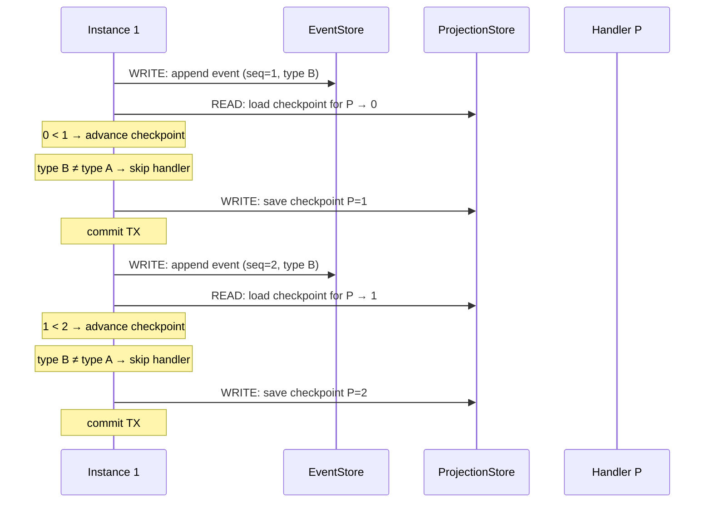
```mermaid
sequenceDiagram
    participant App as Instance 1
    participant ES as EventStore
    participant PS as ProjectionStore
    participant P as Handler P

    App->>ES: WRITE: append event (seq=1, type B)
    App->>PS: READ: load checkpoint for P → 0
    Note over App: 0 < 1 → advance checkpoint
    Note over App: type B ≠ type A → skip handler
    App->>PS: WRITE: save checkpoint P=1
    Note over App: commit TX

    App->>ES: WRITE: append event (seq=2, type B)
    App->>PS: READ: load checkpoint for P → 1
    Note over App: 1 < 2 → advance checkpoint
    Note over App: type B ≠ type A → skip handler
    App->>PS: WRITE: save checkpoint P=2
    Note over App: commit TX
```

**Per event:** ES: 1 write | PS: 1 read, 1 write | Handler: 0 calls

Checkpoint reads and writes still happen for every event, but no handler logic runs.

### 2 Instances

#### Best Case: Events published sequentially by different instances

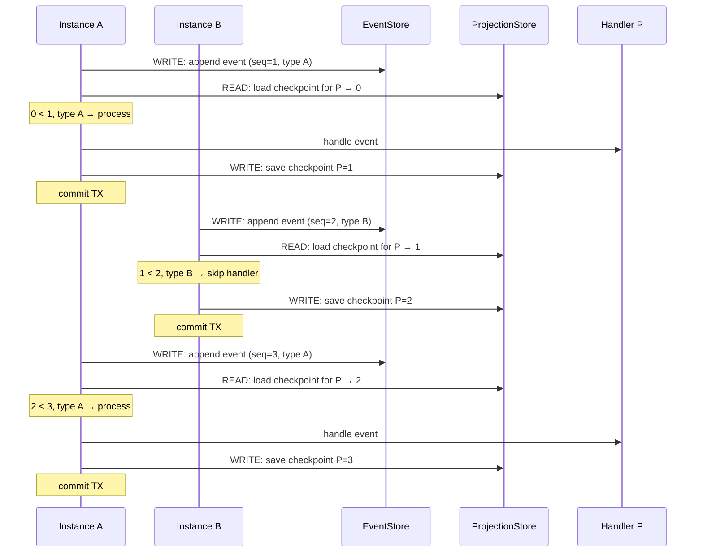
```mermaid
sequenceDiagram
    participant A as Instance A
    participant B as Instance B
    participant ES as EventStore
    participant PS as ProjectionStore
    participant P as Handler P

    A->>ES: WRITE: append event (seq=1, type A)
    A->>PS: READ: load checkpoint for P → 0
    Note over A: 0 < 1, type A → process
    A->>P: handle event
    A->>PS: WRITE: save checkpoint P=1
    Note over A: commit TX

    B->>ES: WRITE: append event (seq=2, type B)
    B->>PS: READ: load checkpoint for P → 1
    Note over B: 1 < 2, type B → skip handler
    B->>PS: WRITE: save checkpoint P=2
    Note over B: commit TX

    A->>ES: WRITE: append event (seq=3, type A)
    A->>PS: READ: load checkpoint for P → 2
    Note over A: 2 < 3, type A → process
    A->>P: handle event
    A->>PS: WRITE: save checkpoint P=3
    Note over A: commit TX
```

**Per event:** ES: 1 write | PS: 1 read, 1 write | Handler: 0 or 1 call

No gaps, no catch-up queries. Instance B advances the checkpoint even for irrelevant events, so Instance A sees no gap when it processes event 3.

#### Worst Case: Concurrent publishes, checkpoint race

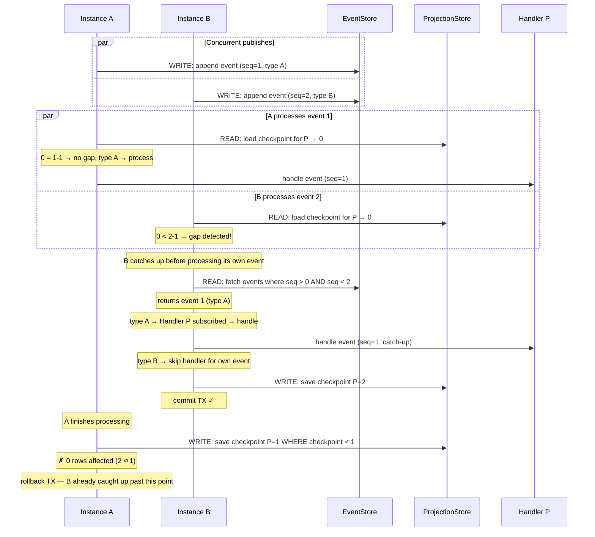
```mermaid
sequenceDiagram
    participant A as Instance A
    participant B as Instance B
    participant ES as EventStore
    participant PS as ProjectionStore
    participant P as Handler P

    par Concurrent publishes
        A->>ES: WRITE: append event (seq=1, type A)
    and
        B->>ES: WRITE: append event (seq=2, type B)
    end

    par A processes event 1
        A->>PS: READ: load checkpoint for P → 0
        Note over A: 0 = 1-1 → no gap, type A → process
        A->>P: handle event (seq=1)
    and B processes event 2
        B->>PS: READ: load checkpoint for P → 0
        Note over B: 0 < 2-1 → gap detected!
    end

    Note over B: B catches up before processing its own event
    B->>ES: READ: fetch events where seq > 0 AND seq < 2
    Note over B: returns event 1 (type A)
    Note over B: type A → Handler P subscribed → handle
    B->>P: handle event (seq=1, catch-up)
    Note over B: type B → skip handler for own event
    B->>PS: WRITE: save checkpoint P=2
    Note over B: commit TX ✓

    Note over A: A finishes processing
    A->>PS: WRITE: save checkpoint P=1 WHERE checkpoint < 1
    Note over A: ✗ 0 rows affected (2 ≮ 1)
    Note over A: rollback TX — B already caught up past this point
```

**How it works:**

1. Each instance loads the checkpoint before processing
2. If `checkpoint < sequence - 1` — a gap exists (another instance published events that this instance hasn't processed yet)
3. The instance catches up by loading all events in the gap from the EventStore and applying them to the handler (filtered by subscribed types)
4. Only then does it process its own event
5. The checkpoint save uses a conditional write: `UPDATE ... SET last_sequence = $new WHERE last_sequence < $new`
6. If 0 rows affected, another instance already advanced past this point — rollback the transaction (the handler work was redundant but idempotent)

This makes Approach A a hybrid: during normal sequential operation, checkpoints advance on every event with zero ES reads. Only under concurrent publishes does it fall back to catch-up queries — the same logic as Approach B, but triggered rarely.

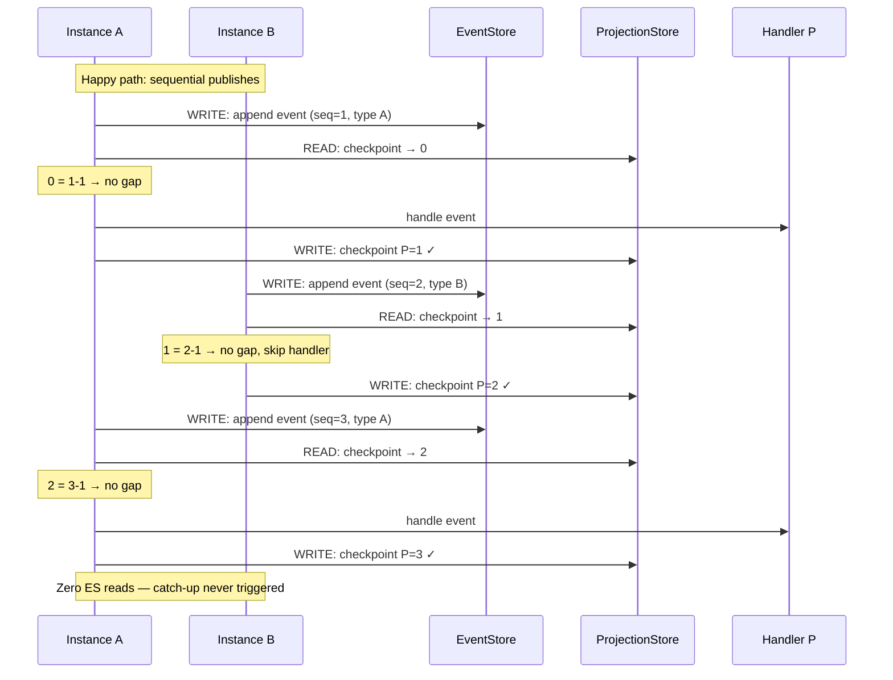
```mermaid
sequenceDiagram
    participant A as Instance A
    participant B as Instance B
    participant ES as EventStore
    participant PS as ProjectionStore
    participant P as Handler P

    Note over A,B: Happy path: sequential publishes

    A->>ES: WRITE: append event (seq=1, type A)
    A->>PS: READ: checkpoint → 0
    Note over A: 0 = 1-1 → no gap
    A->>P: handle event
    A->>PS: WRITE: checkpoint P=1 ✓

    B->>ES: WRITE: append event (seq=2, type B)
    B->>PS: READ: checkpoint → 1
    Note over B: 1 = 2-1 → no gap, skip handler
    B->>PS: WRITE: checkpoint P=2 ✓

    A->>ES: WRITE: append event (seq=3, type A)
    A->>PS: READ: checkpoint → 2
    Note over A: 2 = 3-1 → no gap
    A->>P: handle event
    A->>PS: WRITE: checkpoint P=3 ✓

    Note over A,B: Zero ES reads — catch-up never triggered
```

### 3 Instances

#### Best Case: Sequential publishes

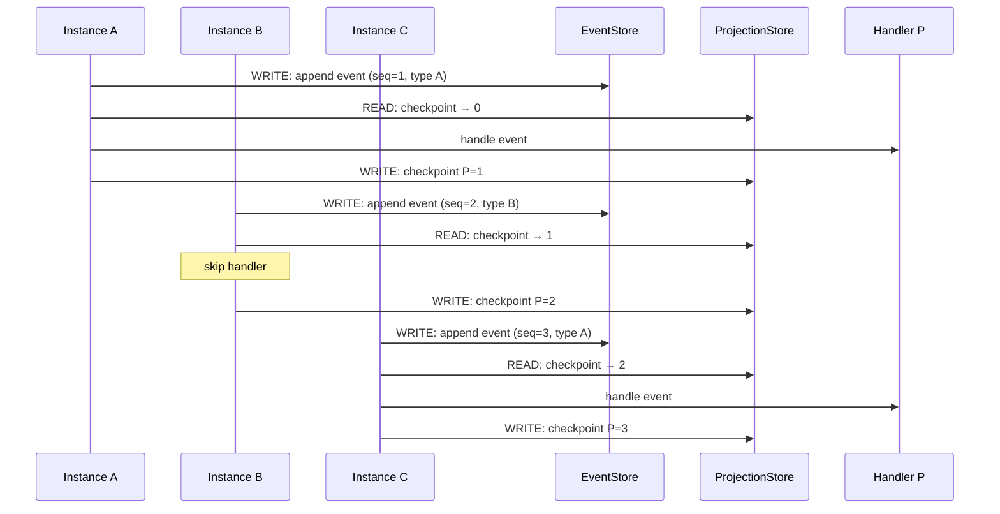
```mermaid
sequenceDiagram
    participant A as Instance A
    participant B as Instance B
    participant C as Instance C
    participant ES as EventStore
    participant PS as ProjectionStore
    participant P as Handler P

    A->>ES: WRITE: append event (seq=1, type A)
    A->>PS: READ: checkpoint → 0
    A->>P: handle event
    A->>PS: WRITE: checkpoint P=1

    B->>ES: WRITE: append event (seq=2, type B)
    B->>PS: READ: checkpoint → 1
    Note over B: skip handler
    B->>PS: WRITE: checkpoint P=2

    C->>ES: WRITE: append event (seq=3, type A)
    C->>PS: READ: checkpoint → 2
    C->>P: handle event
    C->>PS: WRITE: checkpoint P=3
```

**Total for 3 events:** ES: 3 writes | PS: 3 reads, 3 writes | Handler: 2 calls

#### Worst Case: All 3 publish concurrently

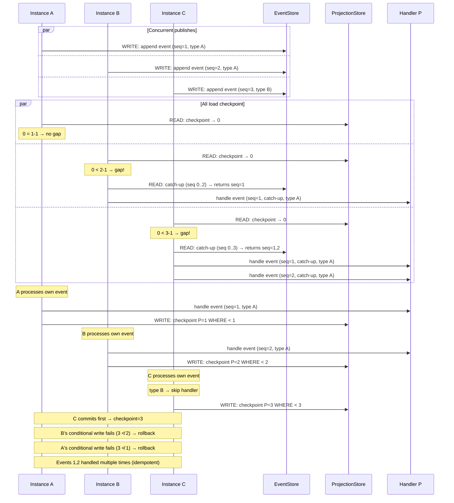
```mermaid
sequenceDiagram
    participant A as Instance A
    participant B as Instance B
    participant C as Instance C
    participant ES as EventStore
    participant PS as ProjectionStore
    participant P as Handler P

    par Concurrent publishes
        A->>ES: WRITE: append event (seq=1, type A)
    and
        B->>ES: WRITE: append event (seq=2, type A)
    and
        C->>ES: WRITE: append event (seq=3, type B)
    end

    par All load checkpoint
        A->>PS: READ: checkpoint → 0
        Note over A: 0 = 1-1 → no gap
    and
        B->>PS: READ: checkpoint → 0
        Note over B: 0 < 2-1 → gap!
        B->>ES: READ: catch-up (seq 0..2) → returns seq=1
        B->>P: handle event (seq=1, catch-up, type A)
    and
        C->>PS: READ: checkpoint → 0
        Note over C: 0 < 3-1 → gap!
        C->>ES: READ: catch-up (seq 0..3) → returns seq=1,2
        C->>P: handle event (seq=1, catch-up, type A)
        C->>P: handle event (seq=2, catch-up, type A)
    end

    Note over A: A processes own event
    A->>P: handle event (seq=1, type A)
    A->>PS: WRITE: checkpoint P=1 WHERE < 1

    Note over B: B processes own event
    B->>P: handle event (seq=2, type A)
    B->>PS: WRITE: checkpoint P=2 WHERE < 2

    Note over C: C processes own event
    Note over C: type B → skip handler
    C->>PS: WRITE: checkpoint P=3 WHERE < 3

    Note over A,C: C commits first → checkpoint=3
    Note over A,C: B's conditional write fails (3 ≮ 2) → rollback
    Note over A,C: A's conditional write fails (3 ≮ 1) → rollback
    Note over A,C: Events 1,2 handled multiple times (idempotent)
```

**Totals:** ES: 3 writes + 2 reads | PS: 3 reads, 3 write attempts (1 succeeds) | Handler: up to 6 calls (3 redundant)

The worst case under concurrency resembles Approach B — catch-up queries and redundant handler calls. But this only happens when multiple instances publish simultaneously. During sequential operation (the common case), there are zero ES reads and zero redundant handler calls.

### Cost Summary (All-Events)

| Scenario | Instances | ES writes | ES reads | PS reads | PS writes | Handler calls | Wasted calls |
|---|---|---|---|---|---|---|---|
| 1 inst, relevant | 1 | 1 | 0 | 1 | 1 | 1 | 0 |
| 1 inst, irrelevant | 1 | 1 | 0 | 1 | 1 | 0 | 0 |
| 2 inst, sequential | 2 | 2 | 0 | 2 | 2 | varies | 0 |
| 2 inst, concurrent | 2 | 2 | up to 1 | 2 | 2 | up to 2 | up to 1 |
| 3 inst, concurrent | 3 | 3 | up to 2 | 3 | 3 | up to 6 | up to 3 |

---

## Approach B: Relevant-Only Processing

The engine only processes handlers that subscribe to the published event type. Irrelevant events are completely skipped — no checkpoint read, no checkpoint write. The tradeoff is that gaps can form, requiring catch-up queries from the EventStore.

### Event Processing Flow

```
Instance publishes event → append to EventStore → get global sequence
│
├─ Handler A: subscribed? yes → begin TX → load checkpoint
│            → if gap: READ EventStore for missed events → apply each
│            → call handler → save checkpoint → commit TX
├─ Handler B: subscribed? no → skip entirely (no TX, no checkpoint)
└─ Handler C: subscribed? yes → (same as A, in parallel)
```

Per handler:

1. Check if the handler subscribes to this event type — if not, skip entirely
2. Begin a transaction
3. Load the checkpoint (last processed global sequence)
4. If `checkpoint >= event sequence` — skip (already processed)
5. If `checkpoint < event sequence - 1` — **gap detected**: query the EventStore for missed events of the handler's subscribed types between checkpoint and current sequence, apply each
6. Call the handler for the current event
7. Save the checkpoint to the current event's global sequence
8. Commit the transaction

The catch-up query (step 5) filters by the handler's subscribed event types, so it only loads relevant missed events.

### 1 Instance

#### Best Case: All events are relevant

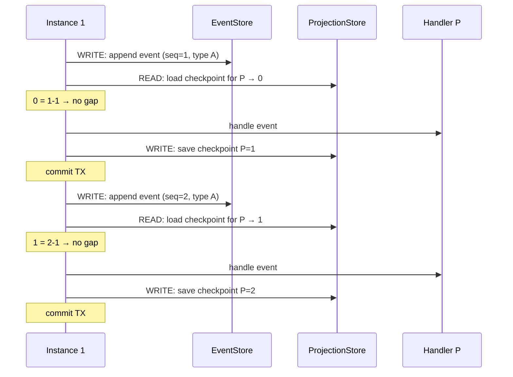
```mermaid
sequenceDiagram
    participant App as Instance 1
    participant ES as EventStore
    participant PS as ProjectionStore
    participant P as Handler P

    App->>ES: WRITE: append event (seq=1, type A)
    App->>PS: READ: load checkpoint for P → 0
    Note over App: 0 = 1-1 → no gap
    App->>P: handle event
    App->>PS: WRITE: save checkpoint P=1
    Note over App: commit TX

    App->>ES: WRITE: append event (seq=2, type A)
    App->>PS: READ: load checkpoint for P → 1
    Note over App: 1 = 2-1 → no gap
    App->>P: handle event
    App->>PS: WRITE: save checkpoint P=2
    Note over App: commit TX
```

**Per event:** ES: 1 write | PS: 1 read, 1 write | Handler: 1 call

Identical to the all-events approach when every event is relevant.

#### Best Case: All events are irrelevant

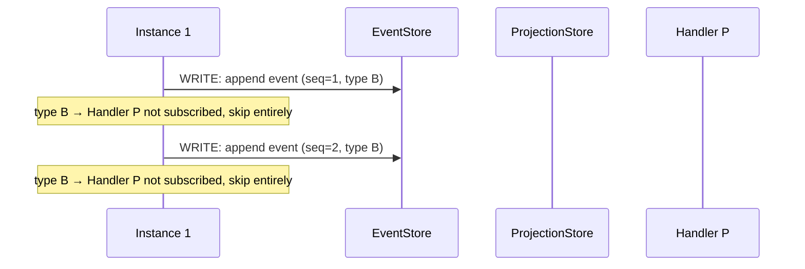
```mermaid
sequenceDiagram
    participant App as Instance 1
    participant ES as EventStore
    participant PS as ProjectionStore
    participant P as Handler P

    App->>ES: WRITE: append event (seq=1, type B)
    Note over App: type B → Handler P not subscribed, skip entirely

    App->>ES: WRITE: append event (seq=2, type B)
    Note over App: type B → Handler P not subscribed, skip entirely
```

**Per event:** ES: 1 write | PS: 0 reads, 0 writes | Handler: 0 calls

Zero projection overhead for irrelevant events.

#### Worst Case: Relevant event after many irrelevant ones

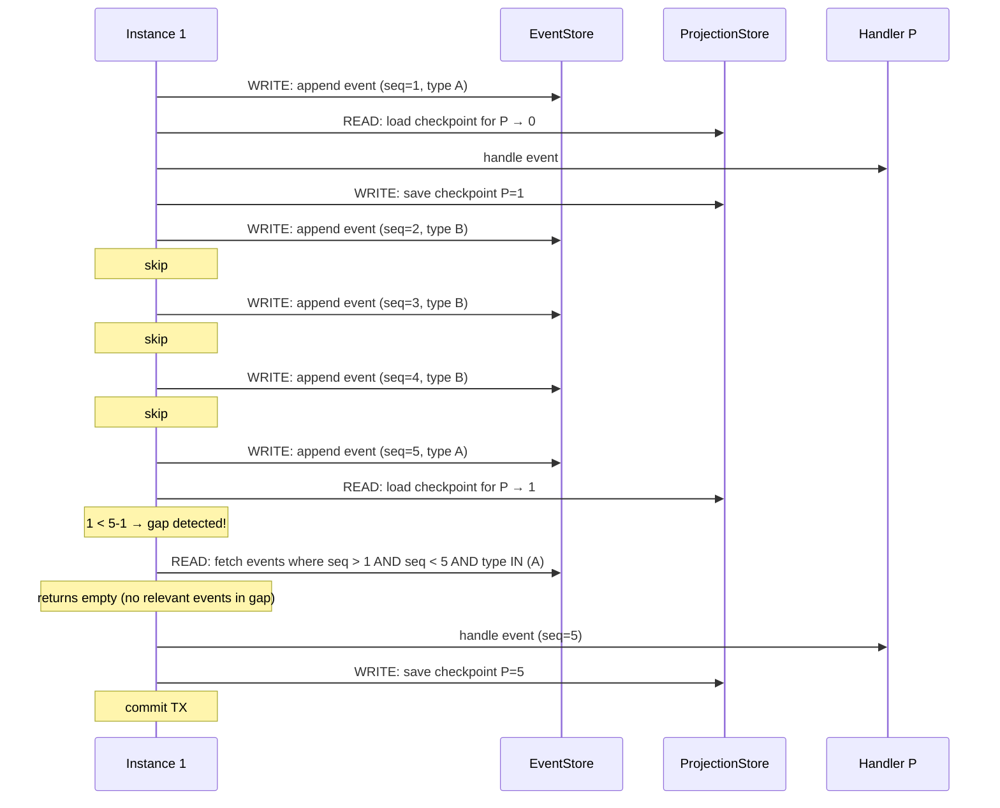
```mermaid
sequenceDiagram
    participant App as Instance 1
    participant ES as EventStore
    participant PS as ProjectionStore
    participant P as Handler P

    App->>ES: WRITE: append event (seq=1, type A)
    App->>PS: READ: load checkpoint for P → 0
    App->>P: handle event
    App->>PS: WRITE: save checkpoint P=1

    App->>ES: WRITE: append event (seq=2, type B)
    Note over App: skip

    App->>ES: WRITE: append event (seq=3, type B)
    Note over App: skip

    App->>ES: WRITE: append event (seq=4, type B)
    Note over App: skip

    App->>ES: WRITE: append event (seq=5, type A)
    App->>PS: READ: load checkpoint for P → 1
    Note over App: 1 < 5-1 → gap detected!
    App->>ES: READ: fetch events where seq > 1 AND seq < 5 AND type IN (A)
    Note over App: returns empty (no relevant events in gap)
    App->>P: handle event (seq=5)
    App->>PS: WRITE: save checkpoint P=5
    Note over App: commit TX
```

**For event 5:** ES: 1 write + 1 read (catch-up query) | PS: 1 read, 1 write | Handler: 1 call

The catch-up query returns empty but still costs a database round-trip.

### 2 Instances

#### Best Case: Sequential publishes, all relevant

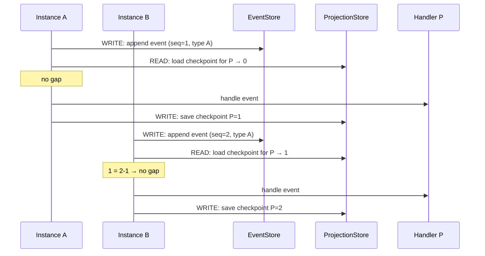
```mermaid
sequenceDiagram
    participant A as Instance A
    participant B as Instance B
    participant ES as EventStore
    participant PS as ProjectionStore
    participant P as Handler P

    A->>ES: WRITE: append event (seq=1, type A)
    A->>PS: READ: load checkpoint for P → 0
    Note over A: no gap
    A->>P: handle event
    A->>PS: WRITE: save checkpoint P=1

    B->>ES: WRITE: append event (seq=2, type A)
    B->>PS: READ: load checkpoint for P → 1
    Note over B: 1 = 2-1 → no gap
    B->>P: handle event
    B->>PS: WRITE: save checkpoint P=2
```

**Per event:** ES: 1 write | PS: 1 read, 1 write | Handler: 1 call

When every event is relevant and sequential, no gaps form.

#### Typical Case: Mixed event types across instances

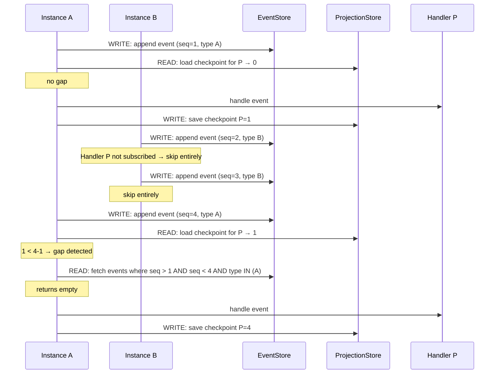
```mermaid
sequenceDiagram
    participant A as Instance A
    participant B as Instance B
    participant ES as EventStore
    participant PS as ProjectionStore
    participant P as Handler P

    A->>ES: WRITE: append event (seq=1, type A)
    A->>PS: READ: load checkpoint for P → 0
    Note over A: no gap
    A->>P: handle event
    A->>PS: WRITE: save checkpoint P=1

    B->>ES: WRITE: append event (seq=2, type B)
    Note over B: Handler P not subscribed → skip entirely

    B->>ES: WRITE: append event (seq=3, type B)
    Note over B: skip entirely

    A->>ES: WRITE: append event (seq=4, type A)
    A->>PS: READ: load checkpoint for P → 1
    Note over A: 1 < 4-1 → gap detected
    A->>ES: READ: fetch events where seq > 1 AND seq < 4 AND type IN (A)
    Note over A: returns empty
    A->>P: handle event
    A->>PS: WRITE: save checkpoint P=4
```

**For event 4:** ES: 1 write + 1 read | PS: 1 read, 1 write | Handler: 1 call

Instance B's irrelevant events created a gap. The catch-up query is cheap (filtered, returns empty) but it's an extra round-trip every time there's a gap.

#### Worst Case: Concurrent publishes with gap

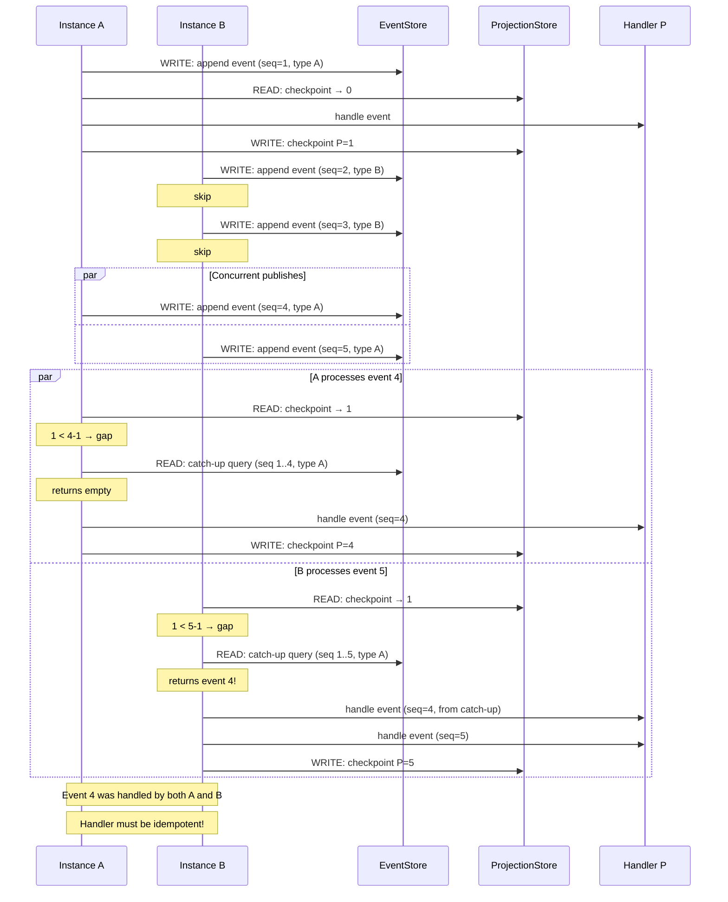
```mermaid
sequenceDiagram
    participant A as Instance A
    participant B as Instance B
    participant ES as EventStore
    participant PS as ProjectionStore
    participant P as Handler P

    A->>ES: WRITE: append event (seq=1, type A)
    A->>PS: READ: checkpoint → 0
    A->>P: handle event
    A->>PS: WRITE: checkpoint P=1

    B->>ES: WRITE: append event (seq=2, type B)
    Note over B: skip

    B->>ES: WRITE: append event (seq=3, type B)
    Note over B: skip

    par Concurrent publishes
        A->>ES: WRITE: append event (seq=4, type A)
    and
        B->>ES: WRITE: append event (seq=5, type A)
    end

    par A processes event 4
        A->>PS: READ: checkpoint → 1
        Note over A: 1 < 4-1 → gap
        A->>ES: READ: catch-up query (seq 1..4, type A)
        Note over A: returns empty
        A->>P: handle event (seq=4)
        A->>PS: WRITE: checkpoint P=4
    and B processes event 5
        B->>PS: READ: checkpoint → 1
        Note over B: 1 < 5-1 → gap
        B->>ES: READ: catch-up query (seq 1..5, type A)
        Note over B: returns event 4!
        B->>P: handle event (seq=4, from catch-up)
        B->>P: handle event (seq=5)
        B->>PS: WRITE: checkpoint P=5
    end

    Note over A,B: Event 4 was handled by both A and B
    Note over A,B: Handler must be idempotent!
```

**Key insight:** Even though only the publisher processes its own event, the catch-up query can pull in events published by other instances, leading to the same event being handled by two different instances. **Idempotent handlers are still required.**

### 3 Instances

#### Best Case: Sequential publishes, mixed types

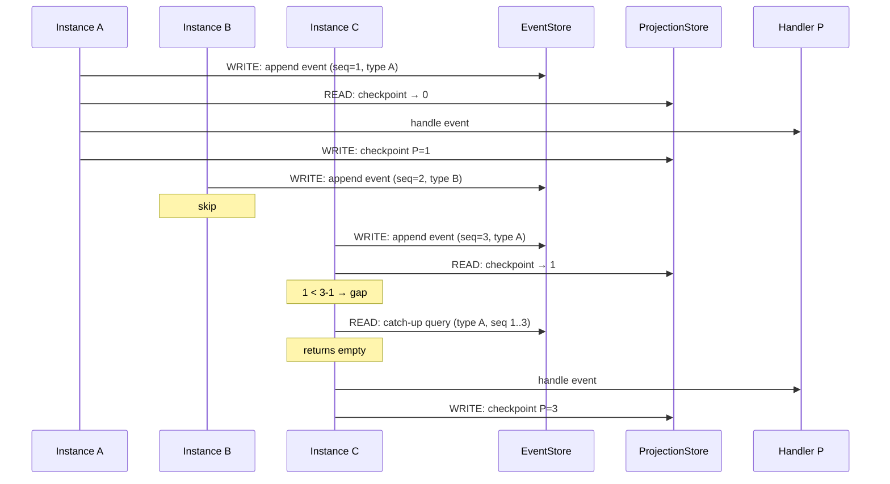
```mermaid
sequenceDiagram
    participant A as Instance A
    participant B as Instance B
    participant C as Instance C
    participant ES as EventStore
    participant PS as ProjectionStore
    participant P as Handler P

    A->>ES: WRITE: append event (seq=1, type A)
    A->>PS: READ: checkpoint → 0
    A->>P: handle event
    A->>PS: WRITE: checkpoint P=1

    B->>ES: WRITE: append event (seq=2, type B)
    Note over B: skip

    C->>ES: WRITE: append event (seq=3, type A)
    C->>PS: READ: checkpoint → 1
    Note over C: 1 < 3-1 → gap
    C->>ES: READ: catch-up query (type A, seq 1..3)
    Note over C: returns empty
    C->>P: handle event
    C->>PS: WRITE: checkpoint P=3
```

**Total for 3 events:** ES: 3 writes + 1 read | PS: 2 reads, 2 writes | Handler: 2 calls

#### Worst Case: All 3 publish relevant events concurrently with gaps

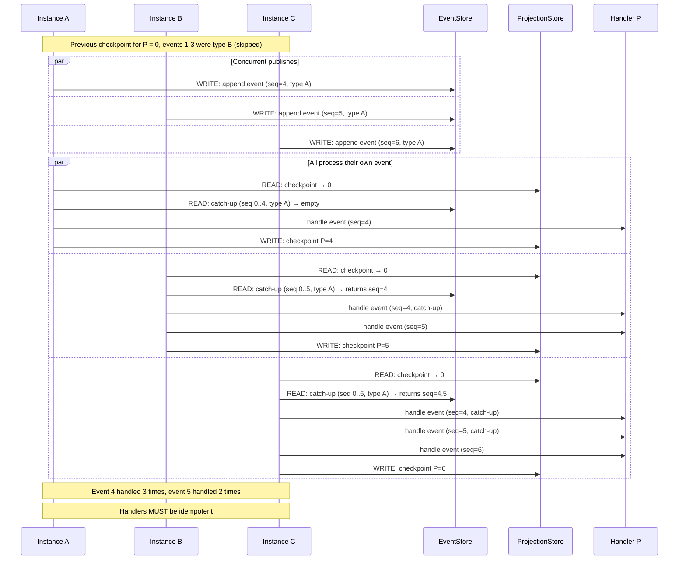
```mermaid
sequenceDiagram
    participant A as Instance A
    participant B as Instance B
    participant C as Instance C
    participant ES as EventStore
    participant PS as ProjectionStore
    participant P as Handler P

    Note over A,C: Previous checkpoint for P = 0, events 1-3 were type B (skipped)

    par Concurrent publishes
        A->>ES: WRITE: append event (seq=4, type A)
    and
        B->>ES: WRITE: append event (seq=5, type A)
    and
        C->>ES: WRITE: append event (seq=6, type A)
    end

    par All process their own event
        A->>PS: READ: checkpoint → 0
        A->>ES: READ: catch-up (seq 0..4, type A) → empty
        A->>P: handle event (seq=4)
        A->>PS: WRITE: checkpoint P=4
    and
        B->>PS: READ: checkpoint → 0
        B->>ES: READ: catch-up (seq 0..5, type A) → returns seq=4
        B->>P: handle event (seq=4, catch-up)
        B->>P: handle event (seq=5)
        B->>PS: WRITE: checkpoint P=5
    and
        C->>PS: READ: checkpoint → 0
        C->>ES: READ: catch-up (seq 0..6, type A) → returns seq=4,5
        C->>P: handle event (seq=4, catch-up)
        C->>P: handle event (seq=5, catch-up)
        C->>P: handle event (seq=6)
        C->>PS: WRITE: checkpoint P=6
    end

    Note over A,C: Event 4 handled 3 times, event 5 handled 2 times
    Note over A,C: Handlers MUST be idempotent
```

**Totals:** ES: 3 writes + 3 reads | PS: 3 reads, 3 writes | Handler: 6 calls (3 unique events, 3 redundant)

---

## Approach C: Relevant-Only with Instance Cache

A refinement of Approach B that eliminates redundant EventStore reads across handlers. Each instance maintains an in-memory `cached_sequence` — the last global sequence it processed through the engine. When a gap is detected, the engine fetches the missing events **once** into a shared cache, and all handlers read from that cache in parallel. The cache is cleared after all handlers complete.

### Event Processing Flow

```
Instance publishes event → append to EventStore → get global sequence S
│
├─ Is any handler subscribed to this event type? If none → update cached_sequence, done
│
├─ Load all handler checkpoints (parallel reads)
├─ min_checkpoint = min(all checkpoints that need this event)
├─ fetch_from = max(cached_sequence, min_checkpoint)
├─ if fetch_from < S - 1:
│    → ES READ (once): fetch events where seq > fetch_from AND seq < S
│    → store in shared cache
│
├─ For each handler (parallel):
│    → filter cached events + current event by handler's subscribed types
│    → skip events where seq <= handler's checkpoint
│    → begin TX → handle each → save checkpoint (conditional write) → commit
│
├─ Clear cache
└─ cached_sequence = S
```

Per handler:

1. Check if the handler subscribes to this event type — if not, skip entirely
2. Read handler's checkpoint (already loaded above)
3. If `checkpoint >= S` — skip (already processed)
4. Filter the shared cache: events with `seq > checkpoint` and matching the handler's subscribed types, plus the current event
5. Begin a transaction
6. Handle each filtered event in sequence
7. Save checkpoint using conditional write: `UPDATE ... SET last_sequence = $new WHERE last_sequence < $new`
8. If 0 rows affected — rollback (another instance advanced past this point)
9. Commit the transaction

### 1 Instance

#### Best Case: All events are relevant

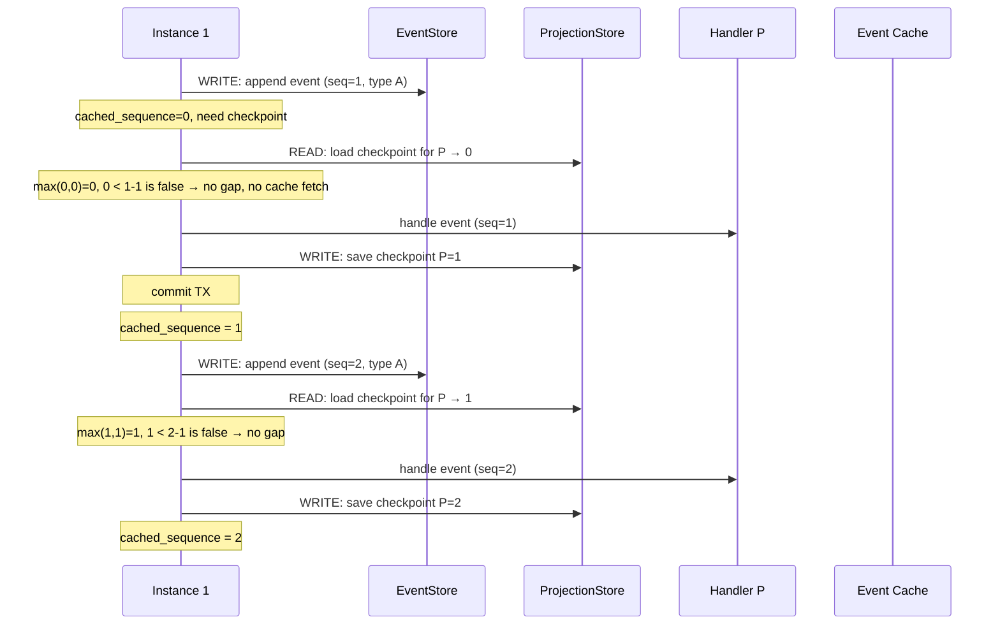
```mermaid
sequenceDiagram
    participant App as Instance 1
    participant ES as EventStore
    participant PS as ProjectionStore
    participant P as Handler P
    participant Cache as Event Cache

    App->>ES: WRITE: append event (seq=1, type A)
    Note over App: cached_sequence=0, need checkpoint
    App->>PS: READ: load checkpoint for P → 0
    Note over App: max(0,0)=0, 0 < 1-1 is false → no gap, no cache fetch
    App->>P: handle event (seq=1)
    App->>PS: WRITE: save checkpoint P=1
    Note over App: commit TX
    Note over App: cached_sequence = 1

    App->>ES: WRITE: append event (seq=2, type A)
    App->>PS: READ: load checkpoint for P → 1
    Note over App: max(1,1)=1, 1 < 2-1 is false → no gap
    App->>P: handle event (seq=2)
    App->>PS: WRITE: save checkpoint P=2
    Note over App: cached_sequence = 2
```

**Per event:** ES: 1 write, 0 reads | PS: 1 read, 1 write | Handler: 1 call | Cache: empty

Identical to Approaches A and B.

#### Best Case: All events are irrelevant

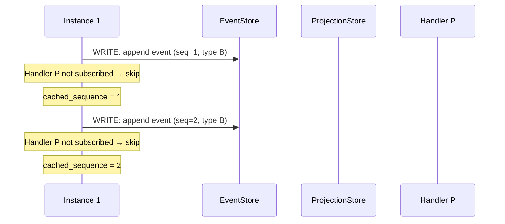
```mermaid
sequenceDiagram
    participant App as Instance 1
    participant ES as EventStore
    participant PS as ProjectionStore
    participant P as Handler P

    App->>ES: WRITE: append event (seq=1, type B)
    Note over App: Handler P not subscribed → skip
    Note over App: cached_sequence = 1

    App->>ES: WRITE: append event (seq=2, type B)
    Note over App: Handler P not subscribed → skip
    Note over App: cached_sequence = 2
```

**Per event:** ES: 1 write, 0 reads | PS: 0 reads, 0 writes | Handler: 0 calls

Zero projection overhead, same as Approach B. The `cached_sequence` still advances, tracking this instance's position.

#### Relevant event after many irrelevant ones

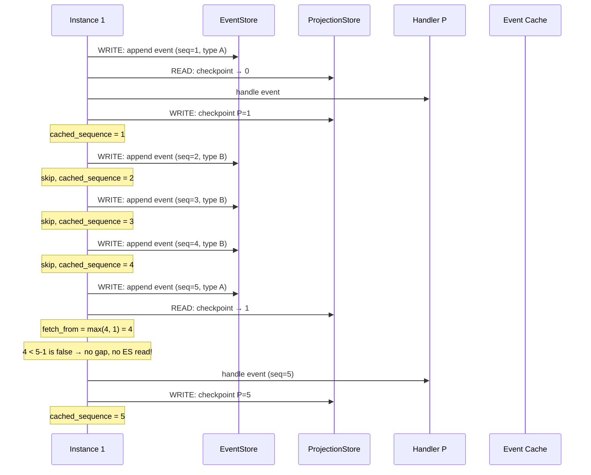
```mermaid
sequenceDiagram
    participant App as Instance 1
    participant ES as EventStore
    participant PS as ProjectionStore
    participant P as Handler P
    participant Cache as Event Cache

    App->>ES: WRITE: append event (seq=1, type A)
    App->>PS: READ: checkpoint → 0
    App->>P: handle event
    App->>PS: WRITE: checkpoint P=1
    Note over App: cached_sequence = 1

    App->>ES: WRITE: append event (seq=2, type B)
    Note over App: skip, cached_sequence = 2

    App->>ES: WRITE: append event (seq=3, type B)
    Note over App: skip, cached_sequence = 3

    App->>ES: WRITE: append event (seq=4, type B)
    Note over App: skip, cached_sequence = 4

    App->>ES: WRITE: append event (seq=5, type A)
    App->>PS: READ: checkpoint → 1
    Note over App: fetch_from = max(4, 1) = 4
    Note over App: 4 < 5-1 is false → no gap, no ES read!
    App->>P: handle event (seq=5)
    App->>PS: WRITE: checkpoint P=5
    Note over App: cached_sequence = 5
```

**For event 5:** ES: 1 write, **0 reads** | PS: 1 read, 1 write | Handler: 1 call

This is the key advantage over Approach B. The `cached_sequence` (4) tells the engine that this instance already saw events 2-4. Since `max(cached_sequence=4, checkpoint=1) = 4` and `4 < 5-1` is false, there is no gap to fill. **No EventStore read needed.**

### 2 Instances

#### Best Case: Sequential publishes, mixed types

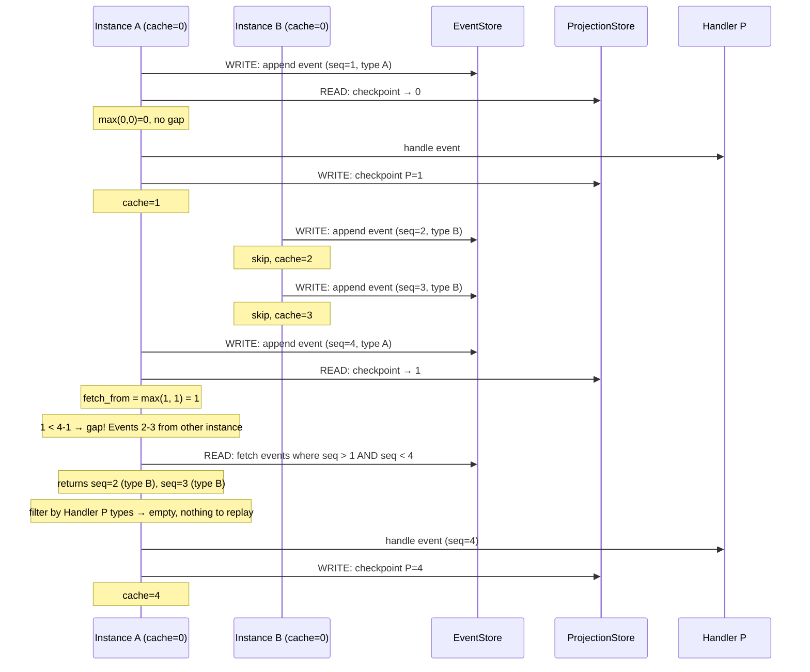
```mermaid
sequenceDiagram
    participant A as Instance A (cache=0)
    participant B as Instance B (cache=0)
    participant ES as EventStore
    participant PS as ProjectionStore
    participant P as Handler P

    A->>ES: WRITE: append event (seq=1, type A)
    A->>PS: READ: checkpoint → 0
    Note over A: max(0,0)=0, no gap
    A->>P: handle event
    A->>PS: WRITE: checkpoint P=1
    Note over A: cache=1

    B->>ES: WRITE: append event (seq=2, type B)
    Note over B: skip, cache=2

    B->>ES: WRITE: append event (seq=3, type B)
    Note over B: skip, cache=3

    A->>ES: WRITE: append event (seq=4, type A)
    A->>PS: READ: checkpoint → 1
    Note over A: fetch_from = max(1, 1) = 1
    Note over A: 1 < 4-1 → gap! Events 2-3 from other instance
    A->>ES: READ: fetch events where seq > 1 AND seq < 4
    Note over A: returns seq=2 (type B), seq=3 (type B)
    Note over A: filter by Handler P types → empty, nothing to replay
    A->>P: handle event (seq=4)
    A->>PS: WRITE: checkpoint P=4
    Note over A: cache=4
```

**For event 4:** ES: 1 write + 1 read | PS: 1 read, 1 write | Handler: 1 call

When another instance published events this instance never saw, a gap exists between `cached_sequence` and `S`. The engine fetches the gap once. After filtering by handler's subscribed types, there may be nothing to replay.

#### Same scenario but with 2 handlers

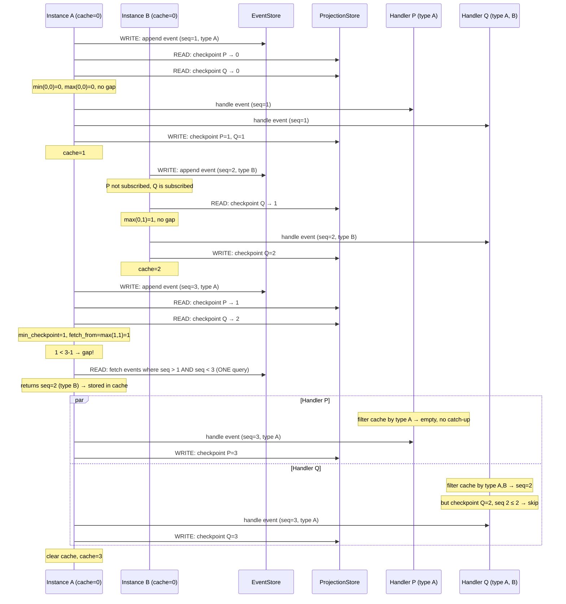
```mermaid
sequenceDiagram
    participant A as Instance A (cache=0)
    participant B as Instance B (cache=0)
    participant ES as EventStore
    participant PS as ProjectionStore
    participant P as Handler P (type A)
    participant Q as Handler Q (type A, B)

    A->>ES: WRITE: append event (seq=1, type A)
    A->>PS: READ: checkpoint P → 0
    A->>PS: READ: checkpoint Q → 0
    Note over A: min(0,0)=0, max(0,0)=0, no gap
    A->>P: handle event (seq=1)
    A->>Q: handle event (seq=1)
    A->>PS: WRITE: checkpoint P=1, Q=1
    Note over A: cache=1

    B->>ES: WRITE: append event (seq=2, type B)
    Note over B: P not subscribed, Q is subscribed
    B->>PS: READ: checkpoint Q → 1
    Note over B: max(0,1)=1, no gap
    B->>Q: handle event (seq=2, type B)
    B->>PS: WRITE: checkpoint Q=2
    Note over B: cache=2

    A->>ES: WRITE: append event (seq=3, type A)
    A->>PS: READ: checkpoint P → 1
    A->>PS: READ: checkpoint Q → 2
    Note over A: min_checkpoint=1, fetch_from=max(1,1)=1
    Note over A: 1 < 3-1 → gap!
    A->>ES: READ: fetch events where seq > 1 AND seq < 3 (ONE query)
    Note over A: returns seq=2 (type B) → stored in cache

    par Handler P
        Note over P: filter cache by type A → empty, no catch-up
        A->>P: handle event (seq=3, type A)
        A->>PS: WRITE: checkpoint P=3
    and Handler Q
        Note over Q: filter cache by type A,B → seq=2
        Note over Q: but checkpoint Q=2, seq 2 ≤ 2 → skip
        A->>Q: handle event (seq=3, type A)
        A->>PS: WRITE: checkpoint Q=3
    end

    Note over A: clear cache, cache=3
```

**For event 3:** ES: 1 write + **1 read (shared)** | PS: 2 reads, 2 writes | Handler: 2 calls

The gap events are fetched **once** and shared. Handler P filters them (nothing relevant). Handler Q sees seq=2 but its checkpoint is already at 2, so it skips. Without the cache, each handler would have queried the EventStore separately (2 reads instead of 1).

#### Worst Case: Concurrent publishes

```mermaid
sequenceDiagram
    participant A as Instance A (cache=0)
    participant B as Instance B (cache=0)
    participant ES as EventStore
    participant PS as ProjectionStore
    participant P as Handler P

    par Concurrent publishes
        A->>ES: WRITE: append event (seq=1, type A)
    and
        B->>ES: WRITE: append event (seq=2, type A)
    end

    par A processes event 1
        A->>PS: READ: checkpoint → 0
        Note over A: fetch_from=max(0,0)=0, 0 < 0 → no gap
        A->>P: handle event (seq=1)
        A->>PS: WRITE: checkpoint P=1 WHERE < 1
    and B processes event 2
        B->>PS: READ: checkpoint → 0
        Note over B: fetch_from=max(0,0)=0, 0 < 1 → gap!
        B->>ES: READ: fetch events where seq > 0 AND seq < 2
        Note over B: returns seq=1 (type A)
        B->>P: handle event (seq=1, catch-up)
        B->>P: handle event (seq=2)
        B->>PS: WRITE: checkpoint P=2 WHERE < 2
    end

    Note over B: B commits first → checkpoint=2
    Note over A: A tries checkpoint=1 WHERE < 1 → fails (2 ≮ 1)
    Note over A: rollback, event 1 already handled by B
    Note over A: cache=1
    Note over B: cache=2
```

**Totals:** ES: 2 writes + 1 read | PS: 2 reads, 2 write attempts (1 succeeds) | Handler: 3 calls (1 redundant)

Same as Approach B under concurrency, but the cache ensures only one ES read even with multiple handlers.

### 3 Instances

#### Best Case: Sequential publishes, mixed types, 2 handlers

```mermaid
sequenceDiagram
    participant A as Instance A (cache=0)
    participant B as Instance B (cache=0)
    participant C as Instance C (cache=0)
    participant ES as EventStore
    participant PS as ProjectionStore
    participant P as Handler P (type A)
    participant Q as Handler Q (type A, B)

    A->>ES: WRITE: append event (seq=1, type A)
    A->>PS: READ: checkpoints P→0, Q→0
    A->>P: handle event (seq=1)
    A->>Q: handle event (seq=1)
    A->>PS: WRITE: P=1, Q=1
    Note over A: cache=1

    B->>ES: WRITE: append event (seq=2, type B)
    Note over B: P not subscribed, Q subscribed
    B->>PS: READ: checkpoint Q → 1
    Note over B: max(0,1)=1, no gap
    B->>Q: handle event (seq=2)
    B->>PS: WRITE: Q=2
    Note over B: cache=2

    C->>ES: WRITE: append event (seq=3, type A)
    C->>PS: READ: checkpoints P→1, Q→2
    Note over C: min=1, fetch_from=max(0,1)=1, 1 < 2 → gap
    C->>ES: READ: fetch events where seq > 1 AND seq < 3 (ONE read)
    Note over C: returns seq=2 (type B), cached

    par Handler P
        Note over P: cache filtered by type A → empty
        C->>P: handle event (seq=3)
        C->>PS: WRITE: P=3
    and Handler Q
        Note over Q: cache has seq=2, but Q checkpoint=2, skip
        C->>Q: handle event (seq=3)
        C->>PS: WRITE: Q=3
    end
    Note over C: clear cache, cache=3
```

**Total for 3 events:** ES: 3 writes + 1 read (shared) | PS: 5 reads, 5 writes | Handler: 5 calls | All work is useful

#### Worst Case: All 3 publish relevant events concurrently

```mermaid
sequenceDiagram
    participant A as Instance A (cache=0)
    participant B as Instance B (cache=0)
    participant C as Instance C (cache=0)
    participant ES as EventStore
    participant PS as ProjectionStore
    participant P as Handler P

    Note over A,C: Previous events 1-3 were type B, all skipped

    par Concurrent publishes
        A->>ES: WRITE: append event (seq=4, type A)
    and
        B->>ES: WRITE: append event (seq=5, type A)
    and
        C->>ES: WRITE: append event (seq=6, type A)
    end

    par A processes event 4
        A->>PS: READ: checkpoint → 0
        Note over A: fetch_from=max(0,0)=0, 0 < 3 → gap
        A->>ES: READ: fetch events seq > 0 AND seq < 4 (ONE read)
        Note over A: returns seq=1,2,3 (type B) → filter: nothing for P
        A->>P: handle event (seq=4)
        A->>PS: WRITE: checkpoint P=4 WHERE < 4
    and B processes event 5
        B->>PS: READ: checkpoint → 0
        Note over B: fetch_from=max(0,0)=0, 0 < 4 → gap
        B->>ES: READ: fetch events seq > 0 AND seq < 5 (ONE read)
        Note over B: returns seq=1-4, filter: seq=4 (type A)
        B->>P: handle event (seq=4, catch-up)
        B->>P: handle event (seq=5)
        B->>PS: WRITE: checkpoint P=5 WHERE < 5
    and C processes event 6
        C->>PS: READ: checkpoint → 0
        Note over C: fetch_from=max(0,0)=0, 0 < 5 → gap
        C->>ES: READ: fetch events seq > 0 AND seq < 6 (ONE read)
        Note over C: returns seq=1-5, filter: seq=4,5 (type A)
        C->>P: handle event (seq=4, catch-up)
        C->>P: handle event (seq=5, catch-up)
        C->>P: handle event (seq=6)
        C->>PS: WRITE: checkpoint P=6 WHERE < 6
    end

    Note over C: C commits first → checkpoint=6
    Note over B: checkpoint=5 WHERE < 5 → fails, rollback
    Note over A: checkpoint=4 WHERE < 4 → fails, rollback
    Note over A,C: With N handlers, each instance still does only 1 ES read
```

**Totals:** ES: 3 writes + 3 reads (1 per instance) | PS: 3 reads, 3 write attempts (1 succeeds) | Handler: 6 calls (3 redundant)

Note: even in the worst case, each instance does only **1 ES read** regardless of how many handlers it has. Without the cache, with N handlers this would be N reads per instance.

---

## Approach D: Relevant-Only + Cache + Row Lock

Builds on Approach C by replacing the conditional checkpoint write with a `SELECT ... FOR UPDATE` row lock at the **start** of the handler transaction. This guarantees exactly-once handler execution per event — no duplicate calls, no idempotency required.

### Key Difference from C

In Approach C, two instances can process the same event concurrently — one wins the conditional write, the other rolls back (wasted work). In Approach D, the row lock serializes access: the second instance blocks until the first commits, then sees the updated checkpoint and skips.

### Event Processing Flow

```
Instance publishes event → append to EventStore → get global sequence S
│
├─ Is any handler subscribed? If none → update cached_sequence, done
│
├─ fetch_from = max(cached_sequence, estimated checkpoint)
├─ if fetch_from < S - 1:
│    → ES READ (once): fetch events where seq > fetch_from AND seq < S
│    → store in shared in-memory cache
│
├─ For each subscribed handler (parallel):
│    begin TX
│    → SELECT checkpoint FOR UPDATE (blocks if another instance holds it)
│    → if checkpoint >= S → skip, commit (release lock)
│    → filter cache by handler's subscribed types + checkpoint
│    → handle gap events + current event
│    → UPDATE checkpoint = S
│    commit TX (release lock)
│
├─ Clear cache
└─ cached_sequence = S
```

Per handler:

1. Begin a transaction
2. `SELECT last_sequence FROM projection_checkpoints WHERE name = $1 FOR UPDATE` — acquires row lock
3. If `checkpoint >= S` — another instance already processed this, skip and commit (releases lock)
4. Filter in-memory cache: events with `seq > checkpoint` matching handler's subscribed types, plus current event
5. Handle each event in sequence
6. `UPDATE projection_checkpoints SET last_sequence = S WHERE name = $1`
7. Commit (releases lock)

### 1 Instance

#### Best Case: All events are relevant

```mermaid
sequenceDiagram
    participant App as Instance 1
    participant ES as EventStore
    participant PS as ProjectionStore
    participant P as Handler P
    participant Cache as Event Cache

    App->>ES: WRITE: append event (seq=1, type A)
    Note over App: cached_sequence=0, no gap, no cache fetch

    App->>PS: SELECT checkpoint FOR UPDATE → 0 (lock acquired)
    Note over App: 0 < 1 → process
    App->>P: handle event (seq=1)
    App->>PS: UPDATE checkpoint P=1
    Note over App: commit TX (lock released)
    Note over App: cached_sequence = 1

    App->>ES: WRITE: append event (seq=2, type A)
    App->>PS: SELECT checkpoint FOR UPDATE → 1
    App->>P: handle event (seq=2)
    App->>PS: UPDATE checkpoint P=2
    Note over App: commit TX, cached_sequence = 2
```

**Per event:** ES: 1 write, 0 reads | PS: 1 read (FOR UPDATE), 1 write | Handler: 1 call

Same cost as Approach C. The `FOR UPDATE` is uncontested on a single instance, so no blocking.

#### Best Case: All events are irrelevant

```mermaid
sequenceDiagram
    participant App as Instance 1
    participant ES as EventStore

    App->>ES: WRITE: append event (seq=1, type B)
    Note over App: Handler P not subscribed → skip
    Note over App: cached_sequence = 1

    App->>ES: WRITE: append event (seq=2, type B)
    Note over App: skip, cached_sequence = 2
```

**Per event:** ES: 1 write | PS: 0 reads, 0 writes | Handler: 0 calls

Zero overhead, same as C.

#### Relevant event after many irrelevant ones

```mermaid
sequenceDiagram
    participant App as Instance 1
    participant ES as EventStore
    participant PS as ProjectionStore
    participant P as Handler P

    App->>ES: WRITE: append event (seq=1, type A)
    App->>PS: SELECT checkpoint FOR UPDATE → 0
    App->>P: handle event (seq=1)
    App->>PS: UPDATE checkpoint P=1
    Note over App: cached_sequence = 1

    App->>ES: WRITE: append (seq=2, type B)
    Note over App: skip, cached_sequence = 2

    App->>ES: WRITE: append (seq=3, type B)
    Note over App: skip, cached_sequence = 3

    App->>ES: WRITE: append (seq=4, type B)
    Note over App: skip, cached_sequence = 4

    App->>ES: WRITE: append event (seq=5, type A)
    Note over App: max(cached_seq=4, checkpoint≈1) = 4
    Note over App: 4 < 5-1 is false → no gap, no ES read
    App->>PS: SELECT checkpoint FOR UPDATE → 1
    App->>P: handle event (seq=5)
    App->>PS: UPDATE checkpoint P=5
    Note over App: cached_sequence = 5
```

**For event 5:** ES: 1 write, 0 reads | PS: 1 read, 1 write | Handler: 1 call

Same as C — the instance cache prevents the ES read.

### 2 Instances

#### Best Case: Sequential publishes, mixed types

```mermaid
sequenceDiagram
    participant A as Instance A (cache=0)
    participant B as Instance B (cache=0)
    participant ES as EventStore
    participant PS as ProjectionStore
    participant P as Handler P

    A->>ES: WRITE: append event (seq=1, type A)
    A->>PS: SELECT checkpoint FOR UPDATE → 0
    A->>P: handle event (seq=1)
    A->>PS: UPDATE checkpoint P=1
    Note over A: cache=1

    B->>ES: WRITE: append event (seq=2, type B)
    Note over B: skip, cache=2

    B->>ES: WRITE: append event (seq=3, type B)
    Note over B: skip, cache=3

    A->>ES: WRITE: append event (seq=4, type A)
    Note over A: fetch_from=max(1,1)=1, 1 < 3 → gap
    A->>ES: READ: fetch events seq > 1 AND seq < 4 (ONE read)
    Note over A: returns seq=2,3 (type B), filter → nothing for P
    A->>PS: SELECT checkpoint FOR UPDATE → 1
    A->>P: handle event (seq=4)
    A->>PS: UPDATE checkpoint P=4
    Note over A: cache=4
```

**For event 4:** ES: 1 write + 1 read | PS: 1 read, 1 write | Handler: 1 call

Same as C — gap from other instance triggers one ES read.

#### Key Scenario: Concurrent publishes (where D differs from C)

```mermaid
sequenceDiagram
    participant A as Instance A (cache=0)
    participant B as Instance B (cache=0)
    participant ES as EventStore
    participant PS as ProjectionStore
    participant P as Handler P

    par Concurrent publishes
        A->>ES: WRITE: append event (seq=1, type A)
    and
        B->>ES: WRITE: append event (seq=2, type A)
    end

    par Both start processing
        A->>PS: SELECT checkpoint FOR UPDATE → 0 (lock acquired ✓)
    and
        B->>PS: SELECT checkpoint FOR UPDATE → ⏳ BLOCKED
    end

    Note over A: A has the lock, processes normally
    A->>P: handle event (seq=1)
    A->>PS: UPDATE checkpoint P=1
    Note over A: commit TX (lock released)
    Note over A: cache=1

    Note over B: B unblocks, reads checkpoint
    B->>PS: (lock acquired) checkpoint = 1
    Note over B: 1 < 2 → process own event
    Note over B: fetch_from=max(0,1)=1, 1 = 2-1 → no gap
    B->>P: handle event (seq=2)
    B->>PS: UPDATE checkpoint P=2
    Note over B: commit TX, cache=2
```

**Totals:** ES: 2 writes, 0 reads | PS: 2 reads, 2 writes | Handler: **2 calls (0 redundant)**

This is the key win. In Approach C, both instances would process event 1 (one wasted). In D, B blocks until A finishes, then sees checkpoint=1 and only processes its own event 2. **Zero wasted handler calls.**

#### Concurrent publishes with gap

```mermaid
sequenceDiagram
    participant A as Instance A (cache=0)
    participant B as Instance B (cache=0)
    participant ES as EventStore
    participant PS as ProjectionStore
    participant P as Handler P

    A->>ES: WRITE: append event (seq=1, type A)
    A->>PS: SELECT checkpoint FOR UPDATE → 0
    A->>P: handle event
    A->>PS: UPDATE checkpoint P=1
    Note over A: cache=1

    B->>ES: WRITE: append event (seq=2, type B)
    Note over B: skip, cache=2

    par Concurrent publishes
        A->>ES: WRITE: append event (seq=3, type A)
    and
        B->>ES: WRITE: append event (seq=4, type A)
    end

    Note over A: fetch_from=max(1,1)=1, 1 < 2 → gap
    A->>ES: READ: fetch events seq > 1 AND seq < 3
    Note over A: returns seq=2 (type B), filter → nothing

    Note over B: fetch_from=max(2,1)=2, 2 < 3 → gap
    B->>ES: READ: fetch events seq > 2 AND seq < 4
    Note over B: returns seq=3 (type A)

    par Both try to lock
        A->>PS: SELECT checkpoint FOR UPDATE → 1 (lock ✓)
    and
        B->>PS: SELECT checkpoint FOR UPDATE → ⏳ BLOCKED
    end

    A->>P: handle event (seq=3)
    A->>PS: UPDATE checkpoint P=3
    Note over A: commit (lock released), cache=3

    Note over B: unblocks, checkpoint=3
    Note over B: cache has seq=3, but checkpoint=3 → skip
    B->>P: handle event (seq=4)
    B->>PS: UPDATE checkpoint P=4
    Note over B: commit, cache=4
```

**Totals:** ES: 2 writes + 2 reads | PS: 2 reads, 2 writes | Handler: **3 calls (0 redundant)**

B's cached event (seq=3) is skipped because A already advanced the checkpoint. No wasted work.

### 3 Instances

#### Worst Case: All 3 publish relevant events concurrently

```mermaid
sequenceDiagram
    participant A as Instance A (cache=0)
    participant B as Instance B (cache=0)
    participant C as Instance C (cache=0)
    participant ES as EventStore
    participant PS as ProjectionStore
    participant P as Handler P

    Note over A,C: Events 1-3 were type B, all skipped

    par Concurrent publishes
        A->>ES: WRITE: append event (seq=4, type A)
    and
        B->>ES: WRITE: append event (seq=5, type A)
    and
        C->>ES: WRITE: append event (seq=6, type A)
    end

    Note over A: fetch_from=max(0,0)=0, gap → ES read
    A->>ES: READ: seq > 0 AND seq < 4 → type B events, filter → empty
    Note over B: fetch_from=max(0,0)=0, gap → ES read
    B->>ES: READ: seq > 0 AND seq < 5 → returns seq=4 (type A)
    Note over C: fetch_from=max(0,0)=0, gap → ES read
    C->>ES: READ: seq > 0 AND seq < 6 → returns seq=4,5 (type A)

    A->>PS: SELECT checkpoint FOR UPDATE → 0 (lock ✓)
    Note over B,C: ⏳ BLOCKED

    A->>P: handle event (seq=4)
    A->>PS: UPDATE checkpoint P=4
    Note over A: commit, cache=4

    B->>PS: (unblocked) checkpoint=4
    Note over B: cache has seq=4, but 4 ≤ 4 → skip
    B->>P: handle event (seq=5)
    B->>PS: UPDATE checkpoint P=5
    Note over B: commit, cache=5

    C->>PS: (unblocked) checkpoint=5
    Note over C: cache has seq=4,5, but both ≤ 5 → skip
    C->>P: handle event (seq=6)
    C->>PS: UPDATE checkpoint P=6
    Note over C: commit, cache=6
```

**Totals:** ES: 3 writes + 3 reads | PS: 3 reads, 3 writes | Handler: **3 calls (0 redundant)**

Compare with Approach C: 6 handler calls (3 redundant). The row lock serializes the instances, and each one skips events already processed by the previous one.

### Cost Summary (Approach D)

| Scenario | Instances | ES writes | ES reads | PS reads | PS writes | Handler calls | Redundant |
|---|---|---|---|---|---|---|---|
| 1 inst, relevant | 1 | 1 | 0 | 1 | 1 | 1 | 0 |
| 1 inst, irrelevant | 1 | 1 | 0 | 0 | 0 | 0 | 0 |
| 1 inst, relevant after gap | 1 | 1 | 0 | 1 | 1 | 1 | 0 |
| 2 inst, sequential | 2 | 2 | 0-1 | 2 | 2 | varies | 0 |
| 2 inst, concurrent | 2 | 2 | 0-1 | 2 | 2 | 2 | 0 |
| 3 inst, concurrent | 3 | 3 | 0-3 | 3 | 3 | 3 | 0 |

**Zero redundant handler calls in all scenarios.**

---

## Approach E: Approach D + Redis Cache

Builds on Approach D by adding Redis as a shared event cache across instances. The row lock (Postgres) still guarantees exactly-once processing. Redis replaces EventStore reads for gap events.

### Key Difference from D

In Approach D, when a gap is detected (events from other instances), the engine reads from the EventStore. In E, the publishing instance writes the event to Redis, and other instances read gap events from Redis instead of the EventStore. Redis is faster and the data is already there.

### Event Processing Flow

```
Instance publishes event → append to EventStore → get global sequence S
│
├─ ZADD redis:events S {event payload}    ← write event to shared Redis cache
│
├─ Is any handler subscribed? If none → update cached_sequence, done
│
├─ Read checkpoints from Redis (MGET, 1 round-trip for all handlers)
├─ min_checkpoint = min(all checkpoints)
├─ if min_checkpoint < S - 1:
│    → ZRANGEBYSCORE redis:events min_checkpoint+1 S-1  ← Redis read, not ES
│    → store in local processing cache
│
├─ For each subscribed handler (parallel):
│    begin TX (Postgres)
│    → SELECT checkpoint FOR UPDATE (row lock)
│    → if checkpoint >= S → skip, commit
│    → filter local cache by handler's types + checkpoint
│    → handle gap events + current event
│    → UPDATE checkpoint = S
│    commit TX
│    → SET redis:checkpoint:{handler} S  ← update Redis checkpoint
│
├─ ZREMRANGEBYSCORE redis:events 0 min(all checkpoints)  ← trim old events
└─ cached_sequence = S
```

### What Redis stores

| Key | Type | Purpose |
|---|---|---|
| `events` | Sorted Set (score=sequence) | Shared event cache |
| `checkpoint:{handler}` | String | Fast checkpoint reads (Postgres is source of truth) |

### 1 Instance

#### All events relevant (identical to D, Redis adds no overhead path)

```mermaid
sequenceDiagram
    participant App as Instance 1
    participant ES as EventStore
    participant Redis
    participant PS as ProjectionStore
    participant P as Handler P

    App->>ES: WRITE: append event (seq=1, type A)
    App->>Redis: ZADD events 1 {event}
    App->>Redis: GET checkpoint:P → 0
    Note over App: no gap

    App->>PS: SELECT checkpoint FOR UPDATE → 0
    App->>P: handle event (seq=1)
    App->>PS: UPDATE checkpoint P=1
    Note over App: commit TX
    App->>Redis: SET checkpoint:P = 1
    Note over App: cached_sequence = 1
```

**Per event:** ES: 1 write | Redis: 1 write + 1 read + 1 write | PS: 1 read, 1 write | Handler: 1 call

Slightly more total operations than D due to Redis writes, but Redis operations are sub-millisecond.

#### All events irrelevant

```mermaid
sequenceDiagram
    participant App as Instance 1
    participant ES as EventStore
    participant Redis

    App->>ES: WRITE: append event (seq=1, type B)
    App->>Redis: ZADD events 1 {event}
    Note over App: no subscribed handlers → skip
    Note over App: cached_sequence = 1
```

**Per event:** ES: 1 write | Redis: 1 write | PS: 0 | Handler: 0

One extra Redis write compared to D, but no PS or handler overhead.

### 2 Instances

#### Key Scenario: Gap from other instance (where E shines over D)

```mermaid
sequenceDiagram
    participant A as Instance A
    participant B as Instance B
    participant ES as EventStore
    participant Redis
    participant PS as ProjectionStore
    participant P as Handler P

    A->>ES: WRITE: append event (seq=1, type A)
    A->>Redis: ZADD events 1 {event}
    A->>PS: SELECT checkpoint FOR UPDATE → 0
    A->>P: handle event (seq=1)
    A->>PS: UPDATE checkpoint P=1
    A->>Redis: SET checkpoint:P = 1
    Note over A: cache=1

    B->>ES: WRITE: append event (seq=2, type B)
    B->>Redis: ZADD events 2 {event}
    Note over B: skip, cache=2

    B->>ES: WRITE: append event (seq=3, type B)
    B->>Redis: ZADD events 3 {event}
    Note over B: skip, cache=3

    A->>ES: WRITE: append event (seq=4, type A)
    A->>Redis: ZADD events 4 {event}
    A->>Redis: GET checkpoint:P → 1
    Note over A: fetch_from=max(cache=1, checkpoint=1)=1, 1 < 3 → gap
    A->>Redis: ZRANGEBYSCORE events 2 3
    Note over A: returns seq=2,3 (type B), filter → nothing for P

    A->>PS: SELECT checkpoint FOR UPDATE → 1
    A->>P: handle event (seq=4)
    A->>PS: UPDATE checkpoint P=4
    A->>Redis: SET checkpoint:P = 4
    Note over A: cache=4
```

**For event 4:** ES: 1 write, **0 ES reads** | Redis: 1 write + 1 read (checkpoint) + 1 read (gap) + 1 write (checkpoint) | PS: 1 read, 1 write | Handler: 1 call

The gap events come from **Redis instead of EventStore**. No ES reads at all.

#### Concurrent publishes (row lock still prevents duplicates)

```mermaid
sequenceDiagram
    participant A as Instance A
    participant B as Instance B
    participant ES as EventStore
    participant Redis
    participant PS as ProjectionStore
    participant P as Handler P

    par Concurrent publishes
        A->>ES: WRITE: append event (seq=1, type A)
        A->>Redis: ZADD events 1 {event}
    and
        B->>ES: WRITE: append event (seq=2, type A)
        B->>Redis: ZADD events 2 {event}
    end

    A->>Redis: GET checkpoint:P → 0
    Note over A: no gap (seq=1, cache=0)
    B->>Redis: GET checkpoint:P → 0
    Note over B: 0 < 1 → gap
    B->>Redis: ZRANGEBYSCORE events 1 1 → seq=1

    par Both try to lock
        A->>PS: SELECT checkpoint FOR UPDATE → 0 (lock ✓)
    and
        B->>PS: SELECT checkpoint FOR UPDATE → ⏳ BLOCKED
    end

    A->>P: handle event (seq=1)
    A->>PS: UPDATE checkpoint P=1
    Note over A: commit, cache=1
    A->>Redis: SET checkpoint:P = 1

    B->>PS: (unblocked) checkpoint=1
    Note over B: cache has seq=1, but 1 ≤ 1 → skip
    B->>P: handle event (seq=2)
    B->>PS: UPDATE checkpoint P=2
    Note over B: commit, cache=2
    B->>Redis: SET checkpoint:P = 2

    Note over A,B: Zero ES reads, zero redundant handler calls
```

**Totals:** ES: 2 writes, **0 ES reads** | Redis: 2+2 writes, 2+1 reads | PS: 2 reads, 2 writes | Handler: **2 calls (0 redundant)**

### 3 Instances

#### Worst Case: All 3 publish concurrently with gap

```mermaid
sequenceDiagram
    participant A as Instance A
    participant B as Instance B
    participant C as Instance C
    participant ES as EventStore
    participant Redis
    participant PS as ProjectionStore
    participant P as Handler P

    Note over A,C: Events 1-3 were type B, cached in Redis

    par Concurrent publishes
        A->>ES: WRITE: append event (seq=4, type A)
        A->>Redis: ZADD events 4 {event}
    and
        B->>ES: WRITE: append event (seq=5, type A)
        B->>Redis: ZADD events 5 {event}
    and
        C->>ES: WRITE: append event (seq=6, type A)
        C->>Redis: ZADD events 6 {event}
    end

    par All read gap from Redis (not ES!)
        A->>Redis: ZRANGEBYSCORE events 1 3 → type B, filter → empty
    and
        B->>Redis: ZRANGEBYSCORE events 1 4 → seq=4 (type A)
    and
        C->>Redis: ZRANGEBYSCORE events 1 5 → seq=4,5 (type A)
    end

    A->>PS: SELECT checkpoint FOR UPDATE → 0 (lock ✓)
    Note over B,C: ⏳ BLOCKED

    A->>P: handle event (seq=4)
    A->>PS: UPDATE checkpoint P=4, commit

    B->>PS: (unblocked) checkpoint=4, skip cached seq=4
    B->>P: handle event (seq=5)
    B->>PS: UPDATE checkpoint P=5, commit

    C->>PS: (unblocked) checkpoint=5, skip cached seq=4,5
    C->>P: handle event (seq=6)
    C->>PS: UPDATE checkpoint P=6, commit

    Note over A,C: Zero ES reads, zero redundant handler calls
```

**Totals:** ES: 3 writes, **0 ES reads** | Redis: 3+3 writes, 3+3 reads | PS: 3 reads, 3 writes | Handler: **3 calls (0 redundant)**

### Redis Failure Handling

Redis is a cache, not source of truth. If Redis is unavailable:

- **Event write to Redis fails** → fall back to Approach D (ES reads for gap)
- **Checkpoint read from Redis fails** → read from Postgres instead
- **Gap read from Redis fails** → read from EventStore instead
- **Redis data lost (restart without persistence)** → next gap triggers ES read, Redis repopulates naturally

The system degrades gracefully from E to D.

### Cost Summary (Approach E)

| Scenario | Instances | ES writes | ES reads | Redis ops | PS reads | PS writes | Handler calls | Redundant |
|---|---|---|---|---|---|---|---|---|
| 1 inst, relevant | 1 | 1 | 0 | 3 (1w+1r+1w) | 1 | 1 | 1 | 0 |
| 1 inst, irrelevant | 1 | 1 | 0 | 1 (1w) | 0 | 0 | 0 | 0 |
| 2 inst, sequential gap | 2 | 2 | 0 | ~8 | 2 | 2 | varies | 0 |
| 2 inst, concurrent | 2 | 2 | 0 | ~10 | 2 | 2 | 2 | 0 |
| 3 inst, concurrent | 3 | 3 | 0 | ~18 | 3 | 3 | 3 | 0 |

**Zero ES reads and zero redundant handler calls in all scenarios.**

---

## Side-by-Side Comparison

### Behavior Comparison

| Property | A | B | C | D | E |
|---|---|---|---|---|---|
| Irrelevant event cost | PS: 1r+1w | nothing | nothing | nothing | nothing |
| ES reads (sequential, same inst) | never | every gap | never | never | never |
| ES reads (gap from other inst) | never | N per handler | 1 (shared) | 1 (shared) | never (Redis) |
| ES reads (concurrent publish) | 1 | N per handler | 1 (shared) | 1 (shared) | never (Redis) |
| Duplicate handler calls | yes | yes | yes | **never** | **never** |
| Idempotency required | yes | yes | yes | **no** | **no** |
| Blocking under concurrency | no | no | no | yes (row lock) | yes (row lock) |
| Infrastructure | Postgres | Postgres | Postgres | Postgres | Postgres + Redis |
| In-memory state | none | none | cache | cache | cache |

### Cost Per Event (Single Handler, Sequential, Single Instance)

| Scenario | A | B | C | D | E |
|---|---|---|---|---|---|
| Relevant, no gap | PS: 1r+1w | PS: 1r+1w | PS: 1r+1w | PS: 1r+1w | PS: 1r+1w, Redis: 3 |
| Irrelevant | PS: 1r+1w | nothing | nothing | nothing | Redis: 1w |
| Relevant after N irrelevant (same inst) | PS: 1r+1w | PS: 1r+1w, ES: 1r | PS: 1r+1w | PS: 1r+1w | PS: 1r+1w, Redis: 3 |
| Relevant after gap (other inst) | PS: 1r+1w | PS: 1r+1w, ES: 1r | PS: 1r+1w, ES: 1r | PS: 1r+1w, ES: 1r | PS: 1r+1w, Redis: 4 |

### Cost Per Event (N Handlers, 2 Instances with Gap)

| Scenario | A: ES reads | B: ES reads | C: ES reads | D: ES reads | E: ES reads |
|---|---|---|---|---|---|
| Gap from other instance | 0 | N | 1 | 1 | 0 (Redis) |
| Concurrent publish | 1 | N | 1 | 1 | 0 (Redis) |

### Redundant Handler Calls (Worst Case, Concurrent)

| Instances | A | B | C | D | E |
|---|---|---|---|---|---|
| 2 concurrent | up to 1 | up to 1 | up to 1 | **0** | **0** |
| 3 concurrent | up to 3 | up to 3 | up to 3 | **0** | **0** |

### Key Insights

1. **A → B → C** is an optimization path for reducing overhead on irrelevant events and ES reads. All three still allow duplicate handler calls under concurrency.

2. **D adds the row lock**, which eliminates duplicate handler calls entirely. The tradeoff is that concurrent publishes serialize per handler (one instance blocks while the other processes). This is acceptable because the lock duration is short and it only affects concurrent publishes to the same handler.

3. **E adds Redis on top of D**, eliminating EventStore reads entirely. Gap events come from Redis instead. The tradeoff is an additional infrastructure dependency, but Redis failure degrades gracefully to D.

4. **The progression:**
   - A: simple, pays for irrelevant events
   - B: skips irrelevant events, pays ES reads for gaps
   - C: caches to share ES reads across handlers
   - D: row lock eliminates duplicates, no idempotency needed
   - E: Redis eliminates ES reads entirely

### When to prefer which

**A (All-Events):** Simple system, few event types, low ratio of irrelevant events. Willing to pay PS overhead for simplicity.

**B (Relevant-Only):** Superseded by C in most cases. Use only for the simplest possible implementation with a single handler.

**C (Cache):** Multiple handlers, want to minimize ES reads without adding complexity of row locks. Accepts duplicate handler calls as a tradeoff.

**D (Cache + Row Lock):** Want exactly-once handler execution. Acceptable that concurrent publishes to the same handler serialize briefly. No additional infrastructure beyond Postgres.

**E (Cache + Row Lock + Redis):** High-throughput, multi-instance deployment. Want zero ES reads and zero duplicate handler calls. Willing to add Redis as an infrastructure dependency.